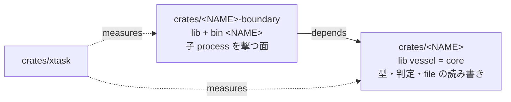

# 設計: core の境界 — core-lines は本体だけを数え、子 process を撃つ I/O 面は境界 crate へ分ける（binary は 1 つ）

- 要件: [FR47](../../design-intent/spec/srs.html#FR47) 契約表 / [FR48](../../design-intent/spec/srs.html#FR48) 受付の余地 / [NFR2](../../design-intent/spec/srs.html#NFR2) 大きさの上限
- 憲法: [C4](../../design-intent/spec/constitution.html#c4) core の大きさは CI の deny gate・上限の変更は A2 / [C13.2](../../design-intent/spec/constitution.html#c13) 境界 crate / [C2.2](../../design-intent/spec/constitution.html#c2) crate 名は NAME から導く / [C11](../../design-intent/spec/constitution.html#c11) lint / [C12.3](../../design-intent/spec/constitution.html#c12) 歯の比 / [A2](../../design-intent/spec/constitution.html#a2) 閾の変更は user 裁定 / [N4](../../design-intent/spec/constitution.html#n4) C4 の上限を超える変更は拒む
- 決定: [ADR-0033](../../design-intent/decisions/ADR-0033-core-lines-count-source-only-and-io-lives-in-a-boundary-crate.html)（core-lines の母集団と境界 crate・user 裁定 2026-09-15）/ [ADR-0001](../../design-intent/decisions/README.html)（単一 binary・不変）/ [ADR-0009](../../design-intent/decisions/README.html)（Rust で閉じる） / [ADR-0062](../../design-intent/decisions/ADR-0062-core-describes-invocations-and-the-boundary-crate-spawns-them.html)（段 2 / 段 3 の形 = 起動の記述と差し替え口・ADR-0033 の実現方法の部分 supersede・§9）
- 台帳: `s2-07l.198`（本設計の契約群の親）・出所の実測 = `s2-07l.303` run 2 / run 3（受付の core の余地で 2 度断られた 2026-09-15）
- 土台: [rules-manifest.md](./rules-manifest.md) §4（R-C4 行と行の数え方）/ [contract-source.md](./contract-source.md) §3（受付の余地）/ [pipeline.md](./pipeline.md) §5.3（純移動の機械証明）

やさしく言うと: 器の本体（core）の行数が上限の 9 割に来て、大きめの契約が受付で止まるようになった。上限は上げず、(1) 数え方から「test の行」を外し（test は別の上限が縛っている）、(2) 外の process を起こす部分だけを別の箱（境界 crate）に移して、本体を「判定と型」に絞る。実行 file は 1 つのまま。

## 1. 何を解くか（実測 2026-09-15・main 17943e7）

| 事実 | 値 |
|---|---|
| core-lines（R-C4-1 の測定値 / 上限） | 36,142 / 40,000（90.3%） |
| うち in-file の歯（`#[cfg(test)]` 区間） | 8,591 行（24%） |
| 子 process を撃つ file（`Command::new` の在る `.rs`） | 14 file / 9,888 行（file 全体・撃つ関数だけならその一部） |
| 受付が size M の契約に許す core の `.rs` 本数（300 行 × N ≤ 余地 3,858） | 12 本 |

- 受付（[contract-source.md](./contract-source.md) §3）は core の余地に「write-set の core の `.rs` 本数 × size」を当てる。余地が細るほど大きい契約が受付で止まり、契約を割る手作業が planner に戻る（`s2-07l.303` は 3 度目で通った）。
- 歯は R-C4-3（歯 / src の比）でも数えている＝R-C4-1 と二重計上（`check_sizes.rs` は `split_test_src` を持つが core-lines がそれを使っていない）。
- 上限 R-C4-1 を上げる案は採らない（憲法の順位: 成長の抑止が 2 位・上げても同じ問題を先送りする）。

## 2. core-lines の母集団 = src の本体（user 裁定 2026-09-15・A2）

- `measure_core_lines` は各 file の `split_test_src(width)` の **src 側だけ**を合計する（in-file の歯を外す）。上限 40,000 と行の数え方（幅の正規化・R-C4.line-width）は不変。
- 歯の量は従来どおり R-C4-3 が縛る（in-file の歯は今も test 側に数えている＝母集団の移動ではなく二重計上の解消）。
- 受付の余地（contract-source.md §3）は同じ式を core 側から呼ぶので自動で追随する（式は 2 か所・fixture で突合する歯が守る）。
- **core-spawn の検出線**（§5 の表の 2 行目・§6 (1) の便＝行 a が同じ便で足す）: measure `measure_core_spawn` を `measure_core_lines` の直後に宣言順で足す。母集団 = `core_dir/src` の `.rs` で `Command::new` を含む行、fact 行は `core-spawn=<n>/<files>`（件数 / file 数）、ok は**常に true**（数だけ出す検出線・値を持たない・deny へ倒すのは最後の移動の便＝§5 の bullet）。check の measure の列と check_tests の `SUMMARY_PIN` に core-lines の直後で載せる。
- 効果（実測）: 36,142 → 27,551（68.9%）。余地 3,858 → 12,449。
- 裁定 id = `user 2026-09-15T09:5xZ`（逐語は `s2-07l.198` notes・AskUserQuestion 問 1「in-file の歯を core-lines から外す (Recommended)」）。manifest の R-C4-1 行は値を変えないので行は不変（C5 の対象外）。数え方の文は [rules-manifest.md](./rules-manifest.md) §4 に 1 行足す。

## 3. crate の構成（user 裁定 2026-09-15・A2・ADR-0033）

- **core** = `crates/<NAME>`（lib `vessel`・現行）。型・閉じた enum・判定の純関数・state dir と repo の file の読み書き・event log。**`std::process::Command` を持たない**（xtask check の measure `core-spawn=0/N`・deny・§5）。
- **境界 crate** = `crates/<NAME>-boundary`（新規・名は NAME 定数から導く・C2.2）。子 process を起こす面 = tmux（`seat` の注入・立て直し）/ git（land・flip-check の base・vessel update）/ claude（headless の runner・lens・席の起動行）/ curl（fleet usage）/ cargo（vessel update・gate の verify 行）/ systemd（tick の unit）/ `sh -c`（gate の verify 行の実行）。**binary `<NAME>` は境界 crate が持つ**（`[[bin]] name = "<NAME>"`・`main.rs` を移す）。ADR-0001 の単一 binary は不変（crate は 2 つ・実行 file は 1 つ）。
- 依存は一方向: 境界 → core。core は境界を知らない（core の判定関数は「撃った結果」を値で受ける＝いまの `Outcome` / `Step` / `Measured` の形をそのまま使う）。
- **xtask の Layout**: `core_dir` = `crates/<NAME>`（NAME を持つ `name.rs` の在る member）・`boundary_dir` = `crates/<NAME>-boundary`（在れば）。R-C4-1 は `core_dir/src` だけ・R-C4-2（file-lines）と R-C4.line-width は全 member の `src`（現行どおり）・R-C4-3 は core + 境界の合計。**歯の置き場**: binary を引く歯（`tests/e2e/` の全体と snapshots・`CARGO_BIN_EXE_<NAME>` は同じ package の bin にしか渡らない＝実測 2026-09-15・8 file）は bin と一緒に境界 crate の `tests/` へ純移動する。in-file の歯（`#[cfg(test)]`）は module と一緒に動く。以後の契約の verify 行は e2e の歯を `-p <NAME>-boundary`・in-file の歯を `-p <NAME>` で名指す。
- **境界 crate の上限**（抜け穴の fence）: rules 行 `R-C4-5`（kind `BoundaryLines`・`ValueShape::Int`・deny）。core の外へ押し出して逃げる形（core を減らすために境界へ判定を持ち込む）を塞ぐ。行を足すのは段 3 (i)（値 = 移した直後の実測 × 1.2 を切り上げ・同じ裁定 id で manifest と憲法 §3 の cell に書く・C10）。段 2 の純移動は機械証明（`MoveSummary`）で判定を境界へ持ち込めないので、行の無い期間に抜け穴は無い。裁定 id = `user 2026-09-15T09:5xZ`（問 2「境界 crate へ分ける (Recommended)」）。
- 憲法 §3 の rules 表（constitution の閾値セル）は manifest の写し＝R-C4-5 を足す周は生成区間を再生成する（xtask の drift 歯）。C4 の条文は「core size / module size / test-to-source ratio / function granularity」の 4 つを名指す＝境界 crate の上限は C4 の「module size」の系ではなく新しい bound なので、**ADR-0033 が C4 の適用を記録し、条文は変えない**（N4 に当たらない: 条文の改訂でも C4 の bound の超過でもない）。

- tests/ の対の一覧は行 b の起票時点の HEAD を写したもので、その後の着地で `crates/scribe2/tests/` と `crates/scribe2/src/snapshots/` に増えた file は同じ `~旧` / `+新` の対で行 b の write-set に足す。`src/snapshots/` の新しい名は insta が bin の module path から付けるので、bin 名が `scribe2` のままの間は接頭辞も `scribe2__tests__` のまま（crate 名 `scribe2_boundary` にはならない）（2026-09-22 に e2e の .rs 8 本と snapshot 4 本を追加・便の worktree の HEAD が母集団）。

- 移す file を write-set か散文で名指す設計 doc は、同じ便で新しい path に書き換える（行 b の write-set の docs/ の列がその母集団・起票後に行が増えた doc は同じ列に足す＝2026-09-22 に ledger-form / pipeline-question / vessel-hook の 3 本を追加。便の worktree で `contracts check` が findings 0 になることが完了の形）。
- bin 本体の `args` の読みが境界 crate へ移ると core の env_reads の母集団が 1 減る（6 → 5）。`crates/xtask/src/env_reads.rs` の in-file の歯が持つ母集団の下限は移動後の数へ合わせる（0/0 の緑を塞ぐ目的は保つ・下限は 1 以上のまま）。

- 入口の flip-check は移した file を rename の対で読む（[pipeline.md](./pipeline.md) §53 / 行 av・本行はその着地後に撃つ）。移動で test 区間に差が出る file（include_str の相対 path が動く e2e 等）には `moved` の札を置いて RED の要求を免除する（札の本数は rules 行の上限の内側）。
- gate の lens 入力は docs の path 置換を畳んで渡す（[gate-cost.md](./gate-cost.md) §41 / 行 ah・本行はその着地後の世代の器で gate を撃つ）。本行の便 153839Z（2026-09-22）は verify 9/9 rc 0 のまま lens 入力 792551 byte が cap 150000 を超えて Gated INCONCLUSIVE になり、内訳は docs/design の契約表の行の path 置換が 754352 byte・code 側が 38199 byte だった。畳んだ後の本文は code 側の diff と印の行だけになる。
- 本行の便 171521Z（2026-09-22・行 ah の着地後の器）は elided=226/484 でも lens 入力 281110 byte が cap を超えて Gated INCONCLUSIVE になった。残ったのは隣り合う契約行の同時書き換え（1 塊でない hunk 19）と、移動で空になった dir の名指し（13）で、[gate-cost.md](./gate-cost.md) §42 / 行 ai がその 2 つを畳む（写しで 86507 byte）。本行はその着地後の世代の器で gate を撃つ。

## 4. 境界の判定（何を境界 crate へ移すか・閉じた規則）

移す = **`std::process::Command` を構築する関数と、その引数を組み立てるためだけの関数**。判定（rc や出力を読んで typed な値へ倒す関数）は core に残す。

| core（残す） | 境界 crate（移す） |
|---|---|
| `Outcome` / `Step` / `Fired` / `Measured` / `Verdict` / `Refuse` の型と判定順（`decide` 等） | `run_line_captured`（`sh -c` の実行）/ `confine` の `systemd-run` の起動 / `admission` の probe |
| `derive_launch` / `with_model` / `fill_launch`（起動行の純関数） | tmux の `send-keys` / `list-panes` / `new-window` / `display-message` |
| `select` / `choose_or_wait` / `until` | `fleet::usage` の curl 起動・`headless::build` が組んだ `Command` の spawn |
| flip-check の判定（xtask・対象外） | land の `git`（archive / worktree / push）・`vessel update` の git と cargo |
| 台帳の数えの組み立て（席の指示文の `{ledger}`） | 台帳の読みが撃つ `bd --readonly` の子 process |

- 規則は 1 つ: **core に `Command::new` が 0**（xtask check の measure・§5）。「どの関数が I/O か」の判断を散文で持たない（C1.2 / N2）＝lint で決まる。
- 境界 crate の関数は「引数 → 子 process の起動 → 生の結果（rc / stdout / stderr の bytes）」だけを返し、解釈しない（解釈は core の純関数）。これも lint で守る: 境界 crate から core の判定関数を呼ぶのは可、core から境界を呼ぶのは依存の向きで不可（Cargo が拒む）。
- 例外なし。`env!` / `std::fs` / `std::net` は core に残る（C2.2 の env は元々読まない・fs は state dir と repo の読み書きで core の責務・net は無い）。

## 5. xtask check の measure（構造で止める）

| measure | 母集団 | 判定 |
|---|---|---|
| `core-lines` | `core_dir/src` の src 側（§2） | ≤ R-C4-1（deny・既存） |
| `core-spawn` | `core_dir/src` の `.rs` で `Command::new` を含む行 | 0 / N（deny・新規・値は持たない＝0 固定・`env-reads` と同型） |
| `boundary-lines` | `boundary_dir/src` の src 側 | ≤ R-C4-5（deny・新規・R-C4-5 が無い周は measure を出さない） |
| `file-lines` / `line-width` / `test-src-ratio` | 全 member の `src`（現行） | 不変 |

- `core-spawn` は §6 (1) の便で足し、移動が終わるまでは **検出線**（数だけ出す・`R-C12-1` と同型の enabled=false）として記録し、最後の移動の便で deny へ倒す（同じ裁定 id・C12.4 の型を借りるが rules 行は持たない＝0 固定の shape 検査）。
- 歯: `check_sizes.rs` の in-file の歯（fixture の `#[cfg(test)]` 区間が core-lines に入らない / boundary の上限を超える fixture / core に `Command::new` の在る fixture が名指される）。

- `core_dir/tests/e2e` を直に読む measure が 2 本在る（`crates/xtask/src/polarity.rs` の `measure`＝極性の snapshot と e2e の file の走査・`crates/xtask/src/check_facts.rs` の e2e の走査）。tests/ が境界 crate へ移る便（行 b）は、この 2 本を `boundary_dir` が在れば `boundary_dir/tests/e2e`、無ければ従来の `core_dir/tests/e2e` を読む形に直す（Layout の `boundary_dir` の 1 判定・2 本目の読み手を作らない）。移した後に `cargo xtask check` が赤にならないことを行 b の done で見る。

## 6. 契約の列（段の中は並列・全部 `s2-07l.198` の子）

| 段 | 契約 | size | 依存 | write-set の芯 |
|---|---|---|---|---|
| 1 | (a) core-lines の母集団を src 側に（§2）+ `core-spawn` の検出線 | S | ADR-0033 | `xtask/check_sizes.rs` / `rules-manifest.md` の 1 行は planner |
| 1 | (b) workspace に `crates/<NAME>-boundary` を足す（lib + `main.rs` の移動 + `[[bin]]`）+ `crates/<NAME>/tests/` の純移動（binary を引く e2e の歯と snapshots・§3）+ Layout の `boundary_dir` | M（純移動） | ADR-0033・A3 = 非該当（依存 OSS を足さない）・走行中の便が全部 Landed した後（verify 行の `-p` を壊さない） | `Cargo.toml` / `crates/<NAME>-boundary/Cargo.toml` / `crates/<NAME>/Cargo.toml` / `xtask/workspace.rs` / `tests/` の移動 |
| 2 | (c)〜(h) 純移動 6 便（module ごと: `pipe/confine+admission` / `pipe/land+follow+stop+mod` / `seat/cycle+mod` / `fleet/usage+cli` / `headless` / `hook/vessel+account`） | S〜M（各 ≤ 5 file） | (b) | 移す関数の file と境界 crate の新 module・呼び手の `use` |
| 3 | (i) `core-spawn` を deny に・`R-C4-5` 行を足す（値は実測で確定・憲法 §3 の cell も同じ周） | S | (c)〜(h) | `xtask/check_sizes.rs` / `rules/manifest.toml` / `rules/mod.rs` |

- 純移動の便は [pipeline.md](./pipeline.md) §5.3 の純移動の機械証明（`MoveSummary`）で lens に渡る。crate を跨ぐ移動は `use` の path が必ず変わる＝残差分に `use` を許す既存の規則の内側。
- 各便の size は「1 file あたりの増分の見積」で、**消える側は `~` 接頭辞**（着地で消える file・[contract-source.md](./contract-source.md) §24・`+新` と `~旧` の対が純移動の宣言形）、受ける側は新規 file（`+`・余地 = 全量）。縮むが残る面だけが `-` である。
- **(b) の面の測り直し（verified 2026-09-20・main f678bd0）**: 移る対象は `crates/scribe2/tests/` の tracked な **35 項目**（歯の file 21 + 外形 snapshot 14）で、記録当時（2026-09-15）の一覧とは違う——`s2-07l.479` の席の自律機能の削除と ADR-0045 の役割の統合で、消えた席の面の歯の file と役割別の brief の snapshot が落ち、起動の列と停止と口座の再開の歯の file と統合後の brief の snapshot が増えた。**焼く直前に一覧を測り直す**（行に写した 35 項目は測った日の値であって固定の規範ではない）。
- **(b) が設計 doc に及ぶ範囲（行の write-set が 14 doc を持つ理由）**: 他の設計 doc の契約表の行が `crates/scribe2/tests/…` の path を write-set に持っており、移した後は契約表の検査がそれらを `write-set-item-unresolved` で落とす（CI が永久に赤・[contract-source.md](./contract-source.md) §24 の memo の型そのもの）。したがって (b) は**その日に該当する設計 doc 全部**の行の path を同じ便で置き換える。この面が行を事実上すべての doc と交差させるので、(b) は走行中の便が全部 Landed した後の単独の周に置く（順序の制約は設計上のもので、実際の時機は起こす側が決める）。
- 検証の形（base で RED）: (a) `core_lines_exclude_in_file_tests` / (b) `layout_finds_the_boundary_crate`（xtask・新しい歯）+ 境界 crate の e2e が bin を引ける（移動した歯が移動先で全部緑・本数が base と同じ・**行の verify は filter を置かず境界 crate の e2e を丸ごと撃つ**＝移動先で 1 本でも落ちれば赤）/ (c)〜(h) 移動ごとに「core の `Command::new` の件数が N → N-k」を pin する歯（§5 の検出線の値・母集団つき）/ (i) `core_spawn_is_denied_when_nonzero`。
- **段 2 / 段 3 の形は §9 が上書きする**（2026-09-24 の測り直し）: 撃つ関数は core の中から呼ばれているので純移動は成立せず、段 2 は「起動の記述と差し替え口」の置換 6 便（行 c〜h）、段 3 は行 i になる。上の表の段 2 の行と、(c)〜(h) の件数を pin する歯の形は記録当時の見積である。

## 7. 却下案（設計固有）

- **R-C4-1 を上げる（44,000 等）**: 成長の抑止に反し、同じ受付の断りを数か月先送りするだけ。A2 の grill で「上げない」を推奨し裁定された。
- **pure な判定を新 crate `<NAME>-core` へ出す（I/O を残す）**: 移動量が 27k 行で純移動の証明が長引く。I/O を出す方が 3〜5k 行で済み、`Command::new` 0 の lint で境界が機械的に決まる。
- **crate を分けず module の分割と削減だけ**: 数百行しか減らず 90% は続く。上限に近い状態で受付が契約を割らせる運用が残る。
- **境界 crate に上限を置かない**: core から境界へ判定を押し出して core-lines を下げる抜け穴が開く（AI は抜け穴を突く・user 指摘 2026-09-14）。

## 8. 後続

- 契約表の行（contract-source.md §3 の Derived 形）は本 doc の §6 を出所に planner が起票する（`touches` / `surfaces` で write-set を導出）。
- v3 の材料（`s2-07l.42`）: 境界 crate の関数の形（引数 → 生の結果）は folio2 と共有できる「器の I/O 面」の芽。

## 9. 段 2 / 段 3 の測り直しと行 c〜i（2026-09-24・main 8ca0dc9 / 9f516d3・ADR-0062・§3 の R-C4-5 を測る時点と §4 の「移す関数」と §6 の段 2 / 段 3 の形を上書きする）

やさしく言うと: 外の process を起こす関数は、本体（core）のあちこちから呼ばれていた。そのまま別の箱へ移すと呼び手が壊れるので、本体には「何を起こすかの記述」と「起こす役を差し替える口」だけを置き、実際に起こすのは箱（境界 crate）の 1 か所にする。本体の行数はほとんど減らないが、本体が process を直接起こさなくなり、test が偽物を差して測れるようになる。

- 要件: [NFR2](../../design-intent/spec/srs.html#NFR2) 大きさ（口を置く 1 便の後は S の便に割れる）/ [NFR3](../../design-intent/spec/srs.html#NFR3) 依存（std だけで作る）/ [NFR5](../../design-intent/spec/srs.html#NFR5) 応答（host-guard の git の回数を歯が測る形を全 site へ広げる）/ [NFR6](../../design-intent/spec/srs.html#NFR6) 安全（封じ込めの包みは core に残り、箱の外の子 process は増えない）。ADR-0062 の justifies と同じ 4 つ。
- 決定: [ADR-0062](../../design-intent/decisions/ADR-0062-core-describes-invocations-and-the-boundary-crate-spawns-them.html)（core は起動の記述を差し替え口へ渡し、実物は境界 crate の 1 か所・ADR-0033 の実現方法の部分 supersede）。段 2 の形の user 裁定 id = `user 2026-09-24T00:13Z`（要旨: 案 1 で進める・core の行数が減らないことは了解・段 2 をやめる案は採らない・R-C4-5 を足す時点は core-spawn を deny にする便と同じで、裁定 id `user 2026-09-15T10:07Z` の範囲内。逐語は台帳 `s2-07l.198` の notes）。本節の「採る形」の 1〜9 は ADR-0062 の決定文の SHALL と下の対応表で 1 対 1 に結ぶ。
- 出所: `s2-07l.198` の段 2（(c)〜(h)）と段 3（(i)）を契約表の行へ詰める周。§1〜§3 の決定（core-lines の母集団・境界 crate・依存の向き・R-C4-1 の値）は不変で、本節は段 2 / 段 3 の**形**と R-C4-5 を測る時点だけを上書きする。
- **母集団（実測・main 8ca0dc9・`cargo xtask check` の core-spawn=44/26 と一致）**: core の src で `Command::new` を含む行は 44 行 / 26 file。うち src の本体（core-lines と同じ切り方・§2）が **34 行 / 22 file**、歯の区間が 10 行 / 8 file（git の fixture を作る helper 4・死んだ pid を作る true の起動 4・包みの歯が渡す引数 2）。歯の区間だけに持つ file は 4 本（`pipe/follow.rs`・`pipe/follow_step.rs`・`pipe/admission.rs`・`fleet/store.rs`）。本体 34 行の道具別の内訳は git 10・systemctl 4・tmux 3・sh 3・systemd-run 2・kill 2・bd 2・自分自身 2・claude 1・curl 1・hostname 1・cargo 1・CI の照会 1・doctor が版を照合する bin 1。初版の測り（main b82be74）の本体 33 から、`account/wire.rs` の doctor の版の照合（2026-09-24 着地）が 1 site を足した＝検出線は数を出すだけで増加を止めない（ADR-0062 CSQ-N5）。足された site は行 h に入れた。**行を起票する直前に同じ測りを撃ち直し、増えた site を行へ足す**。
- **決定的な事実（呼び手の数・grep で実測）**: 撃つ関数は core の中から呼ばれている。`pipe/mod.rs` の git の 3 関数は core の 16 file から、`seat/mod.rs` の tmux に届く公開関数は 10 file から呼ばれ（main 9f516d3・8ca0dc9 では 9 で、s2-07l.491.4 が `pipe/dispatch/group.rs` を足した。seat の子 module が私有の tmux の読みを直に呼ぶ 2 file を足すと 12）、`pipe/confine.rs` の包みは Command を値で受けて返し 5 file から呼ばれ、`headless/mod.rs` の構築点は Command を組んで包みへ渡す。core は境界 crate に依存できない（依存は一方向・§3）ので、**撃つ関数だけを境界 crate へ純移動すると呼び手が compile できない**。呼び手ごと移すと land / gate / train / follow 等の便を進める関数群（判定と撃つ面が交互に並ぶ・pipe run の process を指す driver とは別の意味）が丸ごと動き、判定を境界へ押し出す（R-C4-5 が塞ぐ抜け穴そのもの）。＝§6 の「純移動 6 便」は成立せず、pipeline.md §5.3 の純移動の機械証明も使えない（core に残る関数の本文が変わる）。
- **採る形（ADR-0062 の決定文・user 裁定 `user 2026-09-24T00:13Z`）＝起動の記述と差し替え口**:
  1. **起動の記述**（core・型 1 つ）: std の Command と同じ builder の面（new・arg・args・current_dir・env・env_remove・stdin・stdout・stderr・process_group・get_program・get_args・get_envs・get_current_dir・get_process_group＝core の現 site が呼ぶ面の全部・実測。着地した行 c の現物〔main 2ea2975〕は get_current_dir と get_process_group も持つ）と同じ 4 終端（output・status・spawn・exec）を、同じ名・同じ受け手の形で持つ。終端は起動の記述を解釈せず、差し替え口へ渡すだけ。
  2. **差し替え口**（core・trait 1 つ・method は 4 終端と 1 対 1）と、process に 1 回だけ据える関数（OnceLock・2 回目は据えない）。本番の build で据えていない周の終端は io の Unsupported を返す＝各 site の既存の「撃てない」分岐に落ちる（fail-closed・新しい分岐を足さない）。**測れる形に割る**: 「据えた物を解く」は据えた物の Option を受けて None なら Unsupported を返す純関数、「1 回だけ据える」は据える先の OnceLock を引数に受ける関数にし、どちらも cfg なしで build に入れる（本番の build はそれを process の大域の OnceLock に当てる 1 関数を cfg(not(test)) の側に持つだけ）。歯は純関数に None を渡し、局所の OnceLock に 2 回据えて測る＝process の大域の cell には据えない（cargo test の同じ process・複数 thread の周に他の歯へ漏れない）。本番の build の据え付けそのもの（bin の main と e2e の共通の関数）は、別 process の bin を撃つ e2e が全部緑であることで測る。
  3. **実物**（境界 crate・差し替え口の実装 1 つ・行 c の write-set の + の境界 crate の file 1 つ）: 起動の記述を std の Command へ写して撃つ。bin の main の先頭で据える。本行群の後、core と境界 crate の本番の src で std の Command を構築するのはこの 1 file だけになる（core 側は core-spawn・境界 crate 側は boundary-spawn が行 i から deny で続けて測る・採る形 9）。
  4. **e2e の据え付け**: 境界 crate の e2e の test binary は core の lib を同じ process で呼ぶ歯を持つ。e2e の crate root（`tests/e2e/main.rs`）に共通の関数 1 つを置き、OnceLock で同じ実物を process に 1 回だけ据える。libtest には全歯の前に走る入口が無いので、core の lib の起動の site に同じ process で届く歯が site に届く前にそれを呼ぶ。census（実測・main 8ca0dc9）: seat の recent の git の読みを直に呼ぶ歯 2 本（`tests/e2e/hook.rs`）・fleet の host の読みを呼ぶ歯 4 本（`tests/e2e/fleet.rs` 3・`tests/e2e/hook.rs` 1）・host の読みを呼ぶ fixture の helper 2 つ（`tests/e2e/pipe/ratelimit.rs`・helper の先頭で呼ぶ）。host の読みは /etc/hostname を先に読むので fallback の周だけが site に届く。行 c が共通の関数と census の全部の呼び出しを置き（行 f / g は e2e を触らない）、この census を通らずに core の lib を呼ぶ新しい歯は据え忘れる（ADR-0062 CSQ-N2）。
  5. **site の置換**: core の既存の site は構築の字面と use の行だけを置き換える（型の位置で Command を名指す `pipe/confine.rs` の包みと `headless/mod.rs` の構築点では型の字面）。呼び方の形・判定と、関数の引数の数・順・戻りの形は 1 字も変わらない。呼び手は process_group と exec のための CommandExt の import を除き変わらない（CommandExt を use する 5 file = `pipe/dispatch.rs`・`pipe/spawn.rs`・`fleet/usage.rs`・`seat/cycle/launch.rs`・`hook/group.rs`・実測）。
  6. **claude-spawn-points**（`crates/xtask/src/spawn_points.rs`・deny）: std の Command と起動の記述の構築を合わせて数える（2 つの字面の合計が headless/ で 1・その 1 が mod.rs）。flag の字面の検査は不変。
  7. **core の歯は据えずに撃てる**: cfg(test) の build だけ、据えていない周の代わりに歯の区間の実物を使う（置き場は `pipe/mod.rs` の歯の区間の既存の fixture module・同じ型の先例）。実 repo や tmux を撃つ既存の歯はそのまま動く。
  8. **記録する stub**: 撃たれた program と引数と cwd と env の差分（行 c で着地した pipe/mod.rs の歯の区間の記録の型の 4 欄・main 2ea2975 の実測＝cwd は get_current_dir から写る）を覚え、歯が決めた結果を返す。stub は実 process を起こさない設計なので、spawn の終端は失敗だけを返す（std の Child は std の外から作れない。spawn の成功の周は cfg(test) の実物を撃つ歯のまま・ADR-0062 CSQ-N9）。stub は**据えた歯の thread に閉じる**（thread ごとの置き場・同じ process で並んで走る他の歯に漏れない。変異検査の道具は baseline と的の歯の名が無い周を cargo test の複数 thread で走らせるので、process 全体に効く偽物は漏れる）。site が別の thread で撃つ経路は stub で測れず、実物で撃つ（ADR-0062 CSQ-N6）。新しい歯は stub を据えて「その site が差し替え口を通る」ことを測る。base の site は std の Command を直に撃つので stub に記録が残らず RED（字面の pin ではなく挙動の歯）。
  9. **core-spawn の deny と R-C4-5（行 i・同じ便）**: ADR-0033 の「core は Command::new を 0 本しか持たない」を core の src の**本体**（core-lines と同じ切り方・§2＝行頭 cfg(test) より後ろの区間と、名で test の file〔_tests.rs・今は core に 1 本で起動 0〕の全体を歯に数える）で 0 と読み、core-spawn の母集団を本体にして 1 以上を deny にする。歯の区間の cfg(test) の実物と fixture の起動は数えない（量は R-C4-3 が縛る）。同じ便で境界 crate 側にも measure boundary-spawn（境界 crate の src の本体で Command::new を含む行の件数と file 数・同じ切り方）を足し、file 数が 2 以上なら deny にする（値を持たない 0 / 1 固定の shape 検査で rules 行は持たない・core-spawn と同型）。これで「std の Command の構築は境界 crate の 1 file だけ」が行 c の受け入れの 1 回でなく以後も続けて測られる。R-C4-5（kind BoundaryLines・Int・deny）を同じ便で manifest に足す。値はその便の base で測った境界 crate の src の本体 × 1.2 の切り上げ・裁定 id `user 2026-09-15T10:07Z`（測る時点を ADR-0033 の「移した直後」から deny の便の base へ置き換えるのは裁定 `user 2026-09-24T00:13Z` の (2) がこの裁定 id の範囲内と扱った）。
  10. **置き場の罠（実測の規則）**: 歯の区間だけに site を持つ 4 file（`pipe/follow.rs`・`pipe/follow_step.rs`・`pipe/admission.rs`・`fleet/store.rs`）の置換は差分が歯の区間だけなので flip-check の green-on-base に当たる＝その便の bead id で `// flip-check: retroactive` の札を歯の区間の行頭に置き、判定行の `retroactive=N` を notes に残す（gate-cost.md §30 の歯だけの便と同じ型・行 d と行 g）。この置換は fixture の起動の結果を変えない no-op なので変異の proof は「挙動差なし」で、採る形 9 の core-spawn（本体だけ）にも行の verify にも掛からない＝守るのは行の done の「file 全体で `Command::new` 0」の字面（審査が数える）。起動の記述の file は歯の区間を持たない（新規 file の歯の区間は flip-check の not-flippable）。cfg(test) の側の実物を引く use は file の末尾に「cfg(test) だけの行 + use の行」の 2 行で置く（次の非空行が mod でないので flip-check の歯の区間の始点にならず、xtask の区間の切れ目は file の末尾の 2 行だけを歯に数える）。cfg(not(test)) の側の 1 関数は本体に置く（区間の切れ目は行頭の cfg(test) の字面なので当たらない）。
- **ADR-0062 の決定文と行の対応**（各 SHALL を測る行と done の番号）:

| ADR-0062 の SHALL | 採る形 | 行 | 測る所 |
|---|---|---|---|
| 起動の記述の型 1 つ（builder の 13 面と 4 終端・同じ名と受け手の形） | 1 | c | done (1) |
| 終端は解釈せず、4 終端と 1 対 1 の trait 1 つへ渡す | 1・2 | c | done (1) |
| 本番の build で process に 1 回だけ据わり、据えていない周は Unsupported で既存の分岐へ | 2 | c | done (2)（純関数と局所の OnceLock）・done (9)（別 process の bin を撃つ e2e） |
| 実物 1 つを境界 crate の 1 file に持ち bin の main の先頭で据え、std の Command の構築はこの file だけ | 3・9 | c・i | c の done (3)（境界 crate 側は c の受け入れの時点で 1 file・core 側は行 d〜h の置換の後）・i の done (1)（core 側の deny）・i の done (2)（境界 crate 側の deny） |
| e2e の test binary は共通の関数 1 つ（OnceLock）で同じ実物を process に 1 回据える | 4 | c | done (4) |
| site は構築の字面と use の行だけを置換し、呼び方・判定・引数・戻りは不変、呼び手は CommandExt の import だけ | 5 | c〜h | 各行の done (1)(2) |
| claude-spawn-points は std の Command と起動の記述の構築を合わせて数える | 6 | e | done (3) |
| cfg(test) の build では据えずに撃てる（既定は歯の区間の実物） | 7 | c | done (6) |
| 記録する stub（spawn は失敗だけ）は据えた歯の thread の外へ効かない | 8 | c（置き場）・c〜h（使う歯） | c の done (7)・各行の stub の歯 |
| core-spawn は core の src の本体で 0 と読み、1 以上を deny | 9 | i | done (1) |
| R-C4-5 は deny と同じ便で足し、値は base の本体 × 1.2・裁定 id user 2026-09-15T10:07Z | 9 | i | done (3) |
| 撃つ関数の純移動と便を進める関数群ごとの移動は採らない・ADR-0001・ADR-0033 の母集団と構成と向き・R-C4-1 は不変 | — | 全行 | 下の「触らない」 |
| 消すもの（本体で std の Command を直に組む site 34・5 file の CommandExt の import・純移動 6 便の計画） | 5 | c〜h・§6 | 各行の done (1)(2)・§6 の段 2 の行は本節が上書き |

- **効果と代償**: core の本体の行数はほぼ減らない（起動の記述と差し替え口で +150 行前後・site の置換は差 0・境界 crate は +110 行前後）。§1 の「≈2800 行が core の外へ」は撃つ関数を file ごと移す見積で、上の事実で成立しない。core の余地は段 1 (a) が既に戻した（実測 core-lines=44118/60000・main 8ca0dc9）。段 2 が作るのは (1) core の本体の `Command::new` が 0 (2) 起動の口が境界 crate の 1 か所 (3) core の歯が stub で撃てる（`s2-07l.198` notes の head_of の空 sha の生存変異を行 h の歯が殺す）の 3 つである。
- **却下（ADR-0062 の options）**: 撃つ関数だけの純移動（呼び手が compile できない）・便を進める関数群ごと境界 crate へ（判定を境界へ押し出すか切り方が散文になる・便が L 級）・道具ごとの typed な口（子を流しながら読む site に結局 spawn の口が要り、口の定義 file を全行が触る）・段 2 をやめ core-spawn を検出線のまま残す（user 裁定 `user 2026-09-24T00:13Z` で不採用）・core を境界 crate に依存させる（依存が循環して build できない）。
- **行の切り方（write-set が互いに交わらない・呼び手は引数と戻りの形が不変なので触らない）**:

| 行 | 面 | 本体の site | 歯の区間の site | file |
|---|---|---|---|---|
| c | 口の新設 + `pipe/mod.rs` の git の 3 関数 + e2e の据え付け | 3 | 2 | pipe/mod.rs + 新設 2（core / 境界）+ lib 2 + main + e2e 4 |
| d | pipe の便を進める関数群（dispatch・stop・land の finish・follow・follow_step・admission。gate の patch-id は .588 で消えた） | 3 | 3 | 6 |
| e | 包みと claude の構築点（confine・headless・その戻り値に process_group を呼ぶ 2 file・claude-spawn-points） | 9 | 2 | 5 |
| f | 席と tmux と台帳の読み（seat の mod・launch・ledger・recent・account の mod・ledger の mod） | 7 | 0 | 6 |
| g | fleet（usage の read・cli・wait・store） | 3 | 1 | 4 |
| h | hook と導入先（vessel・host_guard・group・consumers・wire・host_guard の歯の file） | 8 | 2 | 6 |
| j | tick の unit の systemctl（seat/tick/install.rs・.583 が段 2 の数え上げの後に足した） | 1 | 0 | 1 |
| 計 | | 35 | 10 | 27 file（site を持つ file） |

- **構造の連鎖（実測・行の write-set に入れた理由）**: (1) `headless/mod.rs` の構築点と `pipe/confine.rs` の包みは Command を引数と戻り値で受け渡す＝同じ行 e。(2) その戻り値に process_group を呼ぶ `pipe/spawn.rs` と `fleet/usage.rs` は std の CommandExt の use が不要になり unused_imports で clippy が落ちる＝行 e に同梱（`fleet/usage.rs` の kill の site も行 e）。(3) claude-spawn-points は headless/ の構築の字面が mod.rs に 1 つであることを求め、0 は fail-closed の違反＝構築の字面が変わる行 e で数える字面を広げる（採る形 6）。(4) exec と process_group のために CommandExt を use する `pipe/dispatch.rs`・`hook/group.rs`・`seat/cycle/launch.rs` は各行が同じ file の use を外す。(5) e2e が core の lib を直に呼んで起動に届く経路は採る形 4 の census で、行 c が共通の関数を据えるので行 f / g の置換の後も値が割れない。(6) pipe の便を進める関数群・headless の runner / lens・gate の verify / lens・review は起動の記述を値で受けて同じ名の method を呼ぶだけなので 1 字も触らない。(7) `account/wire.rs` の版の照合は doctor が bin の中で撃ち、e2e は bin を撃つ（lib を直に呼ぶ歯は 0・実測）ので census に入らない。
- **歯の置き場**: 各行の新しい歯は write-set の file の歯の区間に置き、名は invocation_ に続く行ごとの語（seam_ / stub_ / pipe_git_ / pipe_flow_ / wrap_ / seat_ / fleet_ / hook_）で始め、verify は歯の fn 名の全体を 1 行 1 本で名指す（現物に invocation を含む歯の名は 0・実測）。歯の区間を持たない file（`fleet/cli.rs`・`fleet/usage/read.rs`・`hook/vessel.rs`・`pipe/land/finish.rs`・`seat/ledger.rs`・`seat/recent.rs`）は、撃つ関数が私有か pub(super) なので同じ file の末尾に歯の区間を足す（既存 file なので flip-check が写せる）。歯の区間を `#[path]` の別 file に持つ file（`hook/host_guard.rs` → `hook/host_guard_tests.rs`）は、その歯の file を行の write-set に持ち、新しい歯をそこへ置く（行 h・実測・main c135769）。host 名の読みは /etc/hostname を先に読むので stub が届かず RED の歯を作れない＝行 g の RED は同じ行の curl と CI の照会の歯が持ち、host の site は done の「その file に std の Command が残らない」で測る。R-C4-2（file 1 本 1500 行・幅 120 の正規化）の余地が細い file は `hook/host_guard.rs`（1407）と `pipe/confine.rs`（1362）で、そこへ足す歯は余地の内側に収める（実測・main 8ca0dc9・行 h は host_guard.rs の見込みを growth で 60 行に置く＝size S の既定 100 行は余地 93 に入らない）。
- **行 i（段 3）**: 採る形 9 のとおり core-spawn の母集団を本体にして 1 以上を deny（fact の書式は不変）、境界 crate の boundary-spawn を file 数 2 以上で deny（core-spawn・claude-spawn-points と同じ構造の検査で rules 行を持たない＝ADR-0062 の解釈で C1 の rule value ではなく、値を変えるのは ADR の改訂）、R-C4-5 を manifest に足す。boundary-spawn の fact は `boundary-spawn=<件数>/<file 数>` で、Layout に境界 crate の dir が無い周は出さない（boundary-lines と同じ）。値の見込みは 316（main a4ff309 の境界 crate の本体 = 幅 120 の正規化で 263〔main.rs の歯の区間の前 187 + lib.rs 10 + spawner.rs 66〕の 1.2 倍の切り上げ・ADR-0062 CSQ-P3 の 341 は行 c の前の見積）。**値の正は行 i の便の base で測った本体**（行 c の実物と据え付けを含む）。裁定 id は `user 2026-09-15T10:07Z`（台帳 `s2-07l.198` notes の字面・§2 / §3 が書く 09:5xZ は同じ日の前の是認で、境界 crate の上限を決めた AskUserQuestion の裁定はこちら）で、manifest の他の行の ruling と重ならない（rules-diff の相乗りに当たらない・実測）。limits は R-C4-5 を 12 本目の必須の行として読み（欠けは既存の 11 本と同じく Err）、boundary-lines は Layout に境界 crate の dir が無い周だけ measure を出さない（§5 の表の「R-C4-5 が無い周」を上書き・行と measure が同じ便で入るので行の無い周は起きない）。境界 crate の dir の読み手は `crates/xtask/src/workspace.rs` の `Layout` の既存の `boundary_dir`（`Option` を返す・e2e の置き場の判定と同じ 1 本・write-set の外・不変）で、行 i は `Layout` に欄を足さない。行 i の base の前提「core の本体の起動が 0」は main a4ff309 では満たされない（core-spawn=3/3 のうち本体 1 = seat/tick/install.rs の systemctl・残り 2 は pipe/regate.rs と pipe/mod.rs の歯の区間の fixture）ので、行 j を先に通す（行 i は行 j を depends に持つ）。rules 行を足す面は manifest・`crates/scribe2/src/rules/mod.rs`（variant・ALL・名・値の形）・`crates/scribe2-boundary/tests/e2e/rules.rs`（kind の match の面と manifest の行数 / kind 数の pin）・同じ e2e の rules の外形 snapshot（rows= と kinds= の字面）・`crates/xtask/src/limits.rs`（値を読む・値の個数の歯）・`crates/xtask/src/check_sizes.rs` と `crates/xtask/src/check.rs`（measure 3 本〔core-spawn の母集団の切り替え・boundary-spawn・boundary-lines〕と列）・`crates/xtask/src/check_tests.rs`（SUMMARY_PIN の core-spawn の直後に boundary-spawn、その直後に boundary-lines）・[rules-manifest.md](./rules-manifest.md) の表。**憲法 §3 の cell は design-intent/spec の編集で folio-architect（user が起動する）の別の周**（rules-parity は検出線なので manifest だけの周も門は赤にならない）。
- **行 j（段 2 の追い・行 i の前提）**: 段 2 の数え上げ（main 8ca0dc9）の後に .583（seat-heartbeat.md 行 b・2026-09-24）が `seat/tick/install.rs` に systemctl の本体 1 site（daemon-reload・enable --now・disable --now を撃つ 1 関数）を足した。行 e の包みと同じ形（型の字面だけを起動の記述に替える・`SYSTEMCTL` の定数は `pipe/confine.rs` のまま・引数の順と stdio の null と戻りの u8 は不変）で 1 便に置換し、歯は既存の cfg(test) の mod tests に 1 本足す（記録する stub は `pipe/mod.rs` の歯の区間の既存の module fixture の Stub）。
- **前提（行 c の起票の前）**: user 裁定は済み（`user 2026-09-24T00:13Z`）。ADR-0062 は本節と同じ PR で land し、行 c〜i はその land の後に `s2-07l.198` の子として起票する（起票の直前に母集団と census を測り直す）。
- 触らない: 判定の関数・呼び手の引数と戻りの形・pipe の便を進める関数群の本文・歯の本文（歯の区間の site の置換を除く）・§1〜§3 の決定・R-C4-1 の値・ADR-0001 の単一 binary・host-guard の今の偽 git の口と歯。

<!-- contracts:begin -->
schema = 1

[[contract]]
id = "a"
title = "core-lines の母集団を src の本体に（in-file の歯を外す）+ core-spawn の検出線 — 受付の core の余地も同じ式に"
req = ["NFR3"]
section = "2"
write-set = ["crates/xtask/src/check_sizes.rs", "crates/xtask/src/check.rs", "crates/xtask/src/check_tests.rs", "crates/scribe2/src/pipe/closure.rs", "crates/scribe2/src/pipe/declaration/write_set.rs", "crates/scribe2/src/pipe/declaration.rs", "crates/scribe2/src/pipe/cli/intake.rs", "crates/scribe2-boundary/tests/e2e/pipe/intake.rs", "docs/design/rules-manifest.md"]
verify = ["cargo nextest run -p xtask --no-tests=fail sizes_core_", "cargo nextest run -p scribe2 --no-tests=fail pipe_intake_core_headroom_"]
size = "S"
done = "core-lines が in-file の歯を除いた src 側の合計になり、core-spawn の検出線が fact 行に出て、受付の core の余地が同じ式で数えられる（両側の式の一致を同じ fixture の歯が守る）"

[[contract]]
id = "b"
title = "境界 crate の新設 — lib + bin（main.rs の移動）+ tests/ の純移動 + xtask Layout の boundary_dir + 契約表の行の path 置換"
req = ["NFR3"]
section = "3"
write-set = ["Cargo.toml", "Cargo.lock", "+crates/scribe2-boundary/Cargo.toml", "+crates/scribe2-boundary/src/lib.rs", "+crates/scribe2-boundary/src/main.rs", "+crates/scribe2-boundary/src/snapshots/scribe2__tests__doctor_external_form.snap", "~crates/scribe2/src/main.rs", "~crates/scribe2/src/snapshots/scribe2__tests__doctor_external_form.snap", "crates/scribe2/Cargo.toml", "~crates/scribe2/tests/e2e/fleet.rs", "~crates/scribe2/tests/e2e/headless.rs", "~crates/scribe2/tests/e2e/hook.rs", "~crates/scribe2/tests/e2e/main.rs", "~crates/scribe2/tests/e2e/pipe.rs", "~crates/scribe2/tests/e2e/pipe/dispatch.rs", "~crates/scribe2/tests/e2e/pipe/gate.rs", "~crates/scribe2/tests/e2e/pipe/intake.rs", "~crates/scribe2/tests/e2e/pipe/land.rs", "~crates/scribe2/tests/e2e/pipe/launch_failure.rs", "~crates/scribe2/tests/e2e/pipe/ratelimit.rs", "~crates/scribe2/tests/e2e/pipe/spawn.rs", "~crates/scribe2/tests/e2e/pipe/stop.rs", "~crates/scribe2/tests/e2e/polarity.rs", "~crates/scribe2/tests/e2e/prop.rs", "~crates/scribe2/tests/e2e/rules.rs", "~crates/scribe2/tests/e2e/seat.rs", "~crates/scribe2/tests/e2e/seat/account.rs", "~crates/scribe2/tests/e2e/seat/launch.rs", "~crates/scribe2/tests/e2e/seat/register.rs", "~crates/scribe2/tests/e2e/seat/rules.rs", "~crates/scribe2/tests/e2e/snapshots/e2e__fleet__fleet_external_form.snap", "~crates/scribe2/tests/e2e/snapshots/e2e__headless__headless_external_form.snap", "~crates/scribe2/tests/e2e/snapshots/e2e__headless__headless_runner_prompt_external_form.snap", "~crates/scribe2/tests/e2e/snapshots/e2e__headless__lens_contract_prompt_external_form.snap", "~crates/scribe2/tests/e2e/snapshots/e2e__headless__lens_prompt_external_form.snap", "~crates/scribe2/tests/e2e/snapshots/e2e__hook__hook_brief_orchestrator.snap", "~crates/scribe2/tests/e2e/snapshots/e2e__hook__vessel_external_form.snap", "~crates/scribe2/tests/e2e/snapshots/e2e__pipe__gate__pipe_gate_move_summary_external_form.snap", "~crates/scribe2/tests/e2e/snapshots/e2e__pipe__gate__pipe_record_show_external_form.snap", "~crates/scribe2/tests/e2e/snapshots/e2e__pipe__pipe_external_form.snap", "~crates/scribe2/tests/e2e/snapshots/e2e__polarity__polarity_external_form.snap", "~crates/scribe2/tests/e2e/snapshots/e2e__rules__rules_external_form.snap", "~crates/scribe2/tests/e2e/snapshots/e2e__seat__seat_doctor_external_form.snap", "~crates/scribe2/tests/e2e/snapshots/e2e__seat__seat_usage_external_form.snap", "~crates/scribe2/tests/e2e/ledger.rs", "~crates/scribe2/tests/e2e/ledger_form.rs", "~crates/scribe2/tests/e2e/ledger_memo.rs", "~crates/scribe2/tests/e2e/notify.rs", "~crates/scribe2/tests/e2e/pipe/contracts.rs", "~crates/scribe2/tests/e2e/pipe/refuse.rs", "~crates/scribe2/tests/e2e/pipe/review.rs", "~crates/scribe2/tests/e2e/seat/ruling.rs", "~crates/scribe2/tests/e2e/snapshots/e2e__headless__lens_promise_prompt_external_form.snap", "~crates/scribe2/tests/e2e/snapshots/e2e__ledger_memo__ledger_memo_plan_usage_external_form.snap", "~crates/scribe2/src/snapshots/scribe2__tests__ledger_form_doctor_external_form.snap", "~crates/scribe2/src/snapshots/scribe2__tests__ledger_lint_doctor_external_form.snap", "+crates/scribe2-boundary/tests/e2e/fleet.rs", "+crates/scribe2-boundary/tests/e2e/headless.rs", "+crates/scribe2-boundary/tests/e2e/hook.rs", "+crates/scribe2-boundary/tests/e2e/main.rs", "+crates/scribe2-boundary/tests/e2e/pipe.rs", "+crates/scribe2-boundary/tests/e2e/pipe/dispatch.rs", "+crates/scribe2-boundary/tests/e2e/pipe/gate.rs", "+crates/scribe2-boundary/tests/e2e/pipe/intake.rs", "+crates/scribe2-boundary/tests/e2e/pipe/land.rs", "+crates/scribe2-boundary/tests/e2e/pipe/launch_failure.rs", "+crates/scribe2-boundary/tests/e2e/pipe/ratelimit.rs", "+crates/scribe2-boundary/tests/e2e/pipe/spawn.rs", "+crates/scribe2-boundary/tests/e2e/pipe/stop.rs", "+crates/scribe2-boundary/tests/e2e/polarity.rs", "+crates/scribe2-boundary/tests/e2e/prop.rs", "+crates/scribe2-boundary/tests/e2e/rules.rs", "+crates/scribe2-boundary/tests/e2e/seat.rs", "+crates/scribe2-boundary/tests/e2e/seat/account.rs", "+crates/scribe2-boundary/tests/e2e/seat/launch.rs", "+crates/scribe2-boundary/tests/e2e/seat/register.rs", "+crates/scribe2-boundary/tests/e2e/seat/rules.rs", "+crates/scribe2-boundary/tests/e2e/snapshots/e2e__fleet__fleet_external_form.snap", "+crates/scribe2-boundary/tests/e2e/snapshots/e2e__headless__headless_external_form.snap", "+crates/scribe2-boundary/tests/e2e/snapshots/e2e__headless__headless_runner_prompt_external_form.snap", "+crates/scribe2-boundary/tests/e2e/snapshots/e2e__headless__lens_contract_prompt_external_form.snap", "+crates/scribe2-boundary/tests/e2e/snapshots/e2e__headless__lens_prompt_external_form.snap", "+crates/scribe2-boundary/tests/e2e/snapshots/e2e__hook__hook_brief_orchestrator.snap", "+crates/scribe2-boundary/tests/e2e/snapshots/e2e__hook__vessel_external_form.snap", "+crates/scribe2-boundary/tests/e2e/snapshots/e2e__pipe__gate__pipe_gate_move_summary_external_form.snap", "+crates/scribe2-boundary/tests/e2e/snapshots/e2e__pipe__gate__pipe_record_show_external_form.snap", "+crates/scribe2-boundary/tests/e2e/snapshots/e2e__pipe__pipe_external_form.snap", "+crates/scribe2-boundary/tests/e2e/snapshots/e2e__polarity__polarity_external_form.snap", "+crates/scribe2-boundary/tests/e2e/snapshots/e2e__rules__rules_external_form.snap", "+crates/scribe2-boundary/tests/e2e/snapshots/e2e__seat__seat_doctor_external_form.snap", "+crates/scribe2-boundary/tests/e2e/snapshots/e2e__seat__seat_usage_external_form.snap", "+crates/scribe2-boundary/tests/e2e/ledger.rs", "+crates/scribe2-boundary/tests/e2e/ledger_form.rs", "+crates/scribe2-boundary/tests/e2e/ledger_memo.rs", "+crates/scribe2-boundary/tests/e2e/notify.rs", "+crates/scribe2-boundary/tests/e2e/pipe/contracts.rs", "+crates/scribe2-boundary/tests/e2e/pipe/refuse.rs", "+crates/scribe2-boundary/tests/e2e/pipe/review.rs", "+crates/scribe2-boundary/tests/e2e/seat/ruling.rs", "+crates/scribe2-boundary/tests/e2e/snapshots/e2e__headless__lens_promise_prompt_external_form.snap", "+crates/scribe2-boundary/tests/e2e/snapshots/e2e__ledger_memo__ledger_memo_plan_usage_external_form.snap", "+crates/scribe2-boundary/src/snapshots/scribe2__tests__ledger_form_doctor_external_form.snap", "+crates/scribe2-boundary/src/snapshots/scribe2__tests__ledger_lint_doctor_external_form.snap", "crates/xtask/src/workspace.rs", "crates/xtask/src/mutantsdiff.rs", "crates/xtask/src/check_sizes.rs", "crates/xtask/src/polarity.rs", "crates/xtask/src/check_facts.rs", "crates/xtask/src/env_reads.rs", ".config/nextest.toml", "docs/design/account-autonomy.md", "docs/design/account-lifecycle.md", "docs/design/consumer-sync.md", "docs/design/contract-source.md", "docs/design/core-boundary.md", "docs/design/dialogue-surface.md", "docs/design/dispatcher.md", "docs/design/fleet-event-log.md", "docs/design/fleet-usage.md", "docs/design/gate-cost.md", "docs/design/pipeline-conflict.md", "docs/design/pipeline.md", "docs/design/rules-manifest.md", "docs/design/seat-roles.md", "docs/design/ledger-form.md", "docs/design/pipeline-question.md", "docs/design/vessel-hook.md"]
verify = ["cargo nextest run -p xtask --no-tests=fail layout_finds_the_boundary_crate", "cargo nextest run -p scribe2-boundary --test e2e --no-tests=fail"]
size = "M"
done = "境界 crate が bin と e2e の歯（歯の file 29 + 外形 snapshot 19（e2e 16・src 3）= 48 項目の純移動（xtask の polarity と check_facts の e2e の読み先は boundary_dir へ切り替わり cargo xtask check が緑）（write-set の ~ は bin 本体の main.rs を加えて 49 本））を持ち、移動した歯が移動先で全部緑で本数が base と同じ（母集団は notes）、core 側に tests/ と main.rs と doctor の snapshot が 1 つも残らず、xtask の Layout が境界 crate の dir を返し、17 の設計 doc（write-set の docs/design/ の列の本数）の契約表の行の path 置換の後に contracts check が findings 0・insta の unreferenced が 0（入口の flip-check は pipeline.md 行 av の着地後の世代で撃ち、test 区間に差が出る移動 file は moved の札で免除する）（gate の lens 入力は gate-cost.md 行 ah の畳みで docs の path 置換の hunk を 1 行の印にし、行 ai の段ごとの対と空になった dir の対で隣り合う契約行の同時書き換えと dir の名指しも畳み、code 側の diff だけが lens へ渡って cap に収まる＝行 ai の着地後の世代の器で gate を撃つ）"

[[contract]]
id = "c"
title = "起動の記述と差し替え口 — core に起動の記述（std の Command と同じ builder の面と 4 終端）と差し替え口（trait 1 つ）を置き、境界 crate の実物 1 file を bin の main の先頭と e2e の共通の関数 1 つで process に 1 回据え、pipe/mod.rs の git の 3 関数と歯の区間の true の起動 2 本を置換する（ADR-0062・段 2 の 1 便目・呼び手と引数と戻りの形は不変）"
req = ["NFR3", "NFR2"]
section = "9"
write-set = ["+crates/scribe2/src/invocation.rs", "crates/scribe2/src/lib.rs", "crates/scribe2/src/pipe/mod.rs", "+crates/scribe2-boundary/src/spawner.rs", "crates/scribe2-boundary/src/lib.rs", "crates/scribe2-boundary/src/main.rs", "crates/scribe2-boundary/tests/e2e/main.rs", "crates/scribe2-boundary/tests/e2e/hook.rs", "crates/scribe2-boundary/tests/e2e/fleet.rs", "crates/scribe2-boundary/tests/e2e/pipe/ratelimit.rs"]
verify = ["cargo nextest run -p scribe2 --lib --no-tests=fail invocation_seam_resolves_none_to_unsupported_and_installs_once_per_local_cell", "cargo nextest run -p scribe2 --lib --no-tests=fail invocation_stub_stays_in_the_installing_thread_and_fails_every_spawn", "cargo nextest run -p scribe2 --lib --no-tests=fail invocation_pipe_git_three_functions_pass_args_and_read_results", "cargo nextest run -p scribe2-boundary --test e2e --no-tests=fail"]
size = "M"
done = "(1) core に起動の記述（型 1 つ）と差し替え口（trait 1 つ・method は 4 終端と 1 対 1）が在り、起動の記述は core の現 site が呼ぶ builder の面（new・arg・args・current_dir・env・env_remove・stdin・stdout・stderr・process_group・get_program・get_args・get_envs）と 4 終端（output・status・spawn・exec）を std の Command と同じ名と受け手の形で持ち、終端は起動の記述を解釈せず差し替え口へ渡す (2) 本番の build で差し替え口は process に 1 回だけ据わり（2 回目は据えない）、据えていない周の終端は io の Unsupported を返して各 site の既存の撃てない分岐に落ちる（新しい分岐を足さない）。「据えた物を解く」は Option を受けて None なら Unsupported を返す純関数、「1 回だけ据える」は据える先の OnceLock を引数に受ける関数で、どちらも cfg なしで build に入り（cfg(not(test)) の側は process の大域の OnceLock に当てる 1 関数だけ）、歯 invocation_seam_resolves_none_to_unsupported_and_installs_once_per_local_cell が純関数に None を渡して Unsupported の種類を、歯が作る局所の OnceLock に 2 回据えて 2 回目が断られることを測る（process の大域の cell には据えない） (3) 境界 crate の実物（+ の境界 crate の file 1 つ・起動の記述を std の Command へ写して撃つ）が bin の main の先頭で据えられ、境界 crate の本番の src で std の Command を構築するのはこの file の 1 か所だけ（core 側の本体に残る 31 site は行 d〜h が置換し、core の本体で 0 になるのは採る形 3 の「本行群の後」＝行 i の deny が測る・本行では core-spawn の fact は done (5) の 40/27） (4) e2e の main.rs に共通の関数 1 つが在って OnceLock で同じ実物を process に 1 回だけ据え、core の lib の起動の site に同じ process で届く e2e の歯（recent の git の読みを直に呼ぶ歯 2 本・fleet の host の読みを呼ぶ歯 4 本）と ratelimit.rs の host を読む fixture の helper 2 つが site に届く前にそれを呼ぶ（census は設計 §9 の採る形 4・本行の base で測り直す） (5) pipe/mod.rs の git の 3 関数と歯の区間の true の起動 2 本が起動の記述を通り、3 関数の引数の数・順・戻りの形と呼び手は 1 字も変わらず、pipe/mod.rs の本体（core-lines と同じ切り方＝行頭の cfg(test) より前の区間・採る形 9）に std の Command の構築が 0 で、歯の区間に残るのは done (6) の実物の 1 構築だけ（file 全体で 5 → 1・cargo xtask check の fact 行 core-spawn は本行の base の 44/27 から 40/27 に減り、この値は done の門の cargo xtask check で測る＝件数の verify 行は持たず fact で読む） (6) cfg(test) の build では据えずに撃て、既定は pipe/mod.rs の歯の区間の既存の fixture module に置く実物で、実 repo を作る既存の歯はそのまま緑、起動の記述の file は歯の区間を持たず、その cfg(test) の use は file の末尾の 2 行（cfg(test) だけの行と use の行） (7) 記録する stub（撃たれた program と引数を覚え決めた結果を返す・spawn の終端は失敗だけ）が同じ fixture module に在り、歯 invocation_stub_stays_in_the_installing_thread_and_fails_every_spawn が据えた歯の thread の外（別 thread）では stub が効かないことと spawn が失敗を返すことを測る (8) stub を据えた歯 invocation_pipe_git_three_functions_pass_args_and_read_results が git の 3 関数の program と引数と結果の読み（rc 非 0 は None / false・空の stdout の 1 行読みは None）を測り、base で RED (9) 境界 crate の e2e が全部緑（別 process の bin と e2e の共通の関数が本番の build の据え付けを通る・据え忘れると撃つ面が落ちる）で、core の in-file の歯が全部緑"

[[contract]]
id = "d"
title = "pipe の便を進める関数群の起動の置換 — dispatch / stop / land の finish の本体 3 site と follow / follow_step / admission の歯の区間 3 site を起動の記述へ（ADR-0062・呼び手と引数と戻りの形は不変・dispatch の CommandExt の import を外す・gate.rs の patch-id の site は .588 で消えた）"
req = ["NFR2", "NFR3"]
section = "9"
write-set = ["crates/scribe2/src/pipe/dispatch.rs", "crates/scribe2/src/pipe/stop.rs", "crates/scribe2/src/pipe/land/finish.rs", "crates/scribe2/src/pipe/follow.rs", "crates/scribe2/src/pipe/follow_step.rs", "crates/scribe2/src/pipe/admission.rs"]
verify = ["cargo nextest run -p scribe2 --lib --no-tests=fail invocation_pipe_flow_dispatch_self_launch_failure_is_false", "cargo nextest run -p scribe2 --lib --no-tests=fail invocation_pipe_flow_stop_kill_passes_the_signal_and_pid", "cargo nextest run -p scribe2 --lib --no-tests=fail invocation_pipe_flow_finish_pr_line_goes_through_the_seam"]
depends = ["c"]
size = "S"
done = "(1) write-set の 6 file に Command::new と std の Command の use が 0（本体 3 site と歯の区間 3 site が起動の記述を通る・gate.rs の git patch-id の site は .588〔bc88844〕で消えたので本行の対象ではない・main 2ea2975 の実測）で、関数の引数の数・順・戻りの形・呼び手・判定は 1 字も変わらない (2) dispatch.rs の CommandExt の import が消え、clippy の unused_imports が 0 (3) 記録する stub を据えた歯 3 本（invocation_pipe_flow_dispatch_self_launch_failure_is_false = 自分自身の起動が spawn の失敗で偽・invocation_pipe_flow_stop_kill_passes_the_signal_and_pid = kill の引数・invocation_pipe_flow_finish_pr_line_goes_through_the_seam = PR を開く sh の行の program と引数）が base で RED（land の finish は file の末尾に歯の区間を足す） (4) core の in-file の歯が全部緑 (5) follow.rs / follow_step.rs / admission.rs は歯の区間だけの置換（true の起動の fixture）なので flip-check は green-on-base に当たる＝3 file の歯の区間の行頭に札 // flip-check: retroactive s2-07l.595 を置き（効く 4 条件 = 歯の区間内・行頭・bead id・base から持ち越した札は効かない・札は HEAD から読まれるので commit してから撃つ）、判定行の retroactive=3 を notes に書く。歯の区間の fixture の置換は挙動の差を持たない（true の起動の結果は同じ・採る形 9 のとおり core-spawn は歯の区間を数えず verify の 3 本にも掛からない）ので変異の proof は「no-op＝挙動差なし」と書き、守るのは (1) の Command::new 0（file 全体の字面・審査が数える）である"

[[contract]]
id = "e"
title = "包みと claude の構築点の起動の置換 — confine の systemctl / systemd-run / sh と headless の構築点を起動の記述へ、その戻り値に process_group を呼ぶ spawn.rs と fleet/usage.rs の CommandExt を外し、claude-spawn-points が std の Command と起動の記述の構築を合わせて数える（ADR-0062・呼び手は不変）"
req = ["NFR6", "NFR2", "NFR3"]
section = "9"
write-set = ["crates/scribe2/src/pipe/confine.rs", "crates/scribe2/src/headless/mod.rs", "crates/scribe2/src/pipe/spawn.rs", "crates/scribe2/src/fleet/usage.rs", "crates/xtask/src/spawn_points.rs"]
verify = ["cargo nextest run -p scribe2 --lib --no-tests=fail invocation_wrap_release_shoots_systemctl_kill_then_reset_failed", "cargo nextest run -p scribe2 --lib --no-tests=fail invocation_wrap_headless_build_names_the_program_and_flags", "cargo nextest run -p scribe2 --lib --no-tests=fail invocation_wrap_usage_kill_passes_the_pid", "cargo nextest run -p xtask --no-tests=fail spawn_points_counts_the_invocation_constructor_as_the_build_point"]
depends = ["c"]
size = "S"
done = "(1) confine.rs・headless/mod.rs・fleet/usage.rs に Command::new と std の Command の字面が 0（confine の本体 7 site と歯の区間 2 site・headless の構築点 1 site・fleet/usage の kill 1 site）で、包みの関数と構築点は型の字面だけが起動の記述に替わり、引数の数・順・戻りの形・argv・env の外し方・scope の引数は 1 字も変わらない (2) spawn.rs と fleet/usage.rs の CommandExt の import が消え（fleet/usage.rs の ExitStatusExt は残る）、gate の verify / lens・review・headless の runner / lens は 1 字も変わらず compile する (3) claude-spawn-points が headless/ の構築の字面を std の Command と起動の記述の 2 つで数え、合計がちょうど 1 でそれが mod.rs に在ることを求め、flag の字面の検査は不変で、cargo xtask check が緑 (4) 記録する stub を据えた歯 3 本（invocation_wrap_release_shoots_systemctl_kill_then_reset_failed = systemctl の kill と reset-failed の 2 起動・invocation_wrap_headless_build_names_the_program_and_flags = 構築点の program と flag・invocation_wrap_usage_kill_passes_the_pid = kill の引数）が base で RED、xtask の歯 spawn_points_counts_the_invocation_constructor_as_the_build_point は起動の記述の構築 1 つの fixture を健全と読み base で RED (5) 封じ込めの包みが包んだ起動の記述を差し替え口へ渡すだけで、箱の外で走る子 process は増えない（包みの既存の歯が全部緑） (6) core の in-file の歯が全部緑"

[[contract]]
id = "f"
title = "席と tmux と台帳の読みの起動の置換 — seat の tmux 2 site・席の起動の exec・台帳の bd 2 site・recent の git・口座の pane の読みを起動の記述へ（ADR-0062・呼び手は不変・launch の CommandExt の import を外す）"
req = ["NFR2", "NFR3"]
section = "9"
write-set = ["crates/scribe2/src/seat/mod.rs", "crates/scribe2/src/seat/cycle/launch.rs", "crates/scribe2/src/seat/ledger.rs", "crates/scribe2/src/seat/recent.rs", "crates/scribe2/src/account/mod.rs", "crates/scribe2/src/ledger/mod.rs"]
verify = ["cargo nextest run -p scribe2 --lib --no-tests=fail invocation_seat_tmux_socket_flag_follows_the_socket", "cargo nextest run -p scribe2 --lib --no-tests=fail invocation_seat_account_pane_read_passes_the_target", "cargo nextest run -p scribe2 --lib --no-tests=fail invocation_seat_launch_exec_failure_names_the_reason", "cargo nextest run -p scribe2 --lib --no-tests=fail invocation_seat_ledger_stream_spawn_failure_is_typed", "cargo nextest run -p scribe2 --lib --no-tests=fail invocation_seat_bd_output_failure_is_typed", "cargo nextest run -p scribe2 --lib --no-tests=fail invocation_seat_recent_git_passes_the_repo_args"]
depends = ["c"]
size = "S"
done = "(1) write-set の 6 file に Command::new と std の Command の use が 0（本体 7 site）で、関数の引数の数・順・戻りの形・呼び手・判定は 1 字も変わらない (2) launch.rs の CommandExt の import が消え、exec は起動の記述の終端を通る (3) 記録する stub を据えた歯 6 本（invocation_seat_tmux_socket_flag_follows_the_socket = tmux の socket の引数の付け方〔-S の有無〕・invocation_seat_account_pane_read_passes_the_target = 口座の pane の読みの引数・invocation_seat_launch_exec_failure_names_the_reason = exec の失敗の理由・invocation_seat_ledger_stream_spawn_failure_is_typed = seat の台帳の読みの spawn の失敗の型・invocation_seat_bd_output_failure_is_typed = ledger の bd の起動の失敗の型・invocation_seat_recent_git_passes_the_repo_args = recent の git の引数）が base で RED（seat/ledger.rs と seat/recent.rs は file の末尾に歯の区間を足す） (4) core の in-file の歯が全部緑（tmux の実 socket を撃つ既存の歯は cfg(test) の実物で動く）で、recent の git の読みを直に呼ぶ e2e の歯 2 本は行 c の共通の関数で据わって緑"

[[contract]]
id = "g"
title = "fleet の起動の置換 — usage の curl・host 名の読みの hostname・CI の照会・store の歯の true の起動を起動の記述へ（ADR-0062・呼び手は不変）"
req = ["NFR2", "NFR3"]
section = "9"
write-set = ["crates/scribe2/src/fleet/usage/read.rs", "crates/scribe2/src/fleet/cli.rs", "crates/scribe2/src/fleet/wait.rs", "crates/scribe2/src/fleet/store.rs"]
verify = ["cargo nextest run -p scribe2 --lib --no-tests=fail invocation_fleet_usage_curl_names_the_client_and_args_and_refused_spawn_is_client_missing", "cargo nextest run -p scribe2 --lib --no-tests=fail invocation_fleet_usage_curl_real_writes_config_to_stdin_and_reads_stdout_and_nonzero_rc", "cargo nextest run -p scribe2 --lib --no-tests=fail invocation_fleet_ci_query_names_the_program_and_cwd"]
depends = ["c"]
size = "S"
done = "(1) write-set の 4 file に Command::new と std の Command の use が 0（本体 3 site と歯の区間 1 site）で、関数の引数の数・順・戻りの形・呼び手・判定は 1 字も変わらず、host 名の読みは /etc/hostname を先に読む順を保つ (2) usage の curl の site の終端は spawn（stdin を pipe にして設定を書き wait_with_output で読む）なので採る形 8 のとおり stub は記録だけで spawn は断る＝歯は 2 本に割る: invocation_fleet_usage_curl_names_the_client_and_args_and_refused_spawn_is_client_missing（記録する stub を据え、記録の program が client・args が client_args と同じ列で token を含まず、stub の断りが ClientMissing に落ちる・base では stub に記録が残らず RED）と invocation_fleet_usage_curl_real_writes_config_to_stdin_and_reads_stdout_and_nonzero_rc（据えない周の cfg(test) の実物で撃つ・client は歯が書く sh の fixture script で、stdin を file へ写して本文と 200 の行を stdout に出す周は Ok(本文) と file に config_of の逐語・rc 非 0 で終わる周は ClientFailed・fetch の読みは不変なので base でも緑＝同じ file の歯の区間に前の stub の歯と並べるので flip-check の区間は前の歯で RED）、CI の照会は invocation_fleet_ci_query_names_the_program_and_cwd（記録する stub の記録の program と cwd の欄・採る形 8 の 4 欄のうち 2 つ）が base で RED（fleet/usage/read.rs は file の末尾に歯の区間を足す・host の site は stub が届かないので (1) で測る） (3) core の in-file の歯と境界 crate の e2e が全部緑（host の読みを呼ぶ e2e の歯と fixture の helper は行 c の共通の関数で据わる） (4) fleet/store.rs は歯の区間だけの置換なので flip-check は green-on-base に当たる＝歯の区間の行頭に札 // flip-check: retroactive s2-07l.598 を置き（行 d の (5) と同じ 4 条件・commit してから撃つ）、判定行の retroactive=1 を notes に書く（歯の区間の fixture の置換は no-op で変異の proof は「挙動差なし」・守るのは (1) の Command::new 0 の字面・行 d の (5) と同じ） (5) 材料（main ec16e0c の実測）: fetch の client は 1 番目の引数（usage.rs の reader.client から渡る）なので実物の歯は fixture の sh の path をそこに渡す・fetch は spawn の Err を kind を見ずに UnmeasuredReason::ClientMissing（fleet/mod.rs の閉じた列・語は client_missing）へ写し wait_with_output の Err と rc 非 0 を ClientFailed へ写す・記録する stub の spawn の断りは io の Other（行 c の歯の区間の refused）なので fetch は ClientMissing を返す・CI の照会は fleet/wait.rs の ci_now が cmd の 1 語目を program に残りを args にし current_dir(repo) で撃つので stub の記録の program と cwd で測れる"

[[contract]]
id = "h"
title = "hook と導入先の起動の置換 — vessel の git 3 関数と cargo・host_guard の git ls-files・group の自分自身の起動・consumers の HEAD の読み・wire の版の照合を起動の記述へ、HEAD の読みの空 sha の歯を足す（ADR-0062・呼び手は不変・group の CommandExt の import を外す）"
req = ["NFR5", "NFR2", "NFR3"]
section = "9"
write-set = ["crates/scribe2/src/hook/vessel.rs", "crates/scribe2/src/hook/host_guard.rs", "crates/scribe2/src/hook/host_guard_tests.rs", "crates/scribe2/src/hook/group.rs", "crates/scribe2/src/account/consumers.rs", "crates/scribe2/src/account/wire.rs"]
verify = ["cargo nextest run -p scribe2 --lib --no-tests=fail invocation_hook_vessel_git_and_cargo_pass_their_args", "cargo nextest run -p scribe2 --lib --no-tests=fail invocation_hook_host_guard_ls_files_reads_the_nul_split", "cargo nextest run -p scribe2 --lib --no-tests=fail invocation_hook_group_self_launch_failure_is_false", "cargo nextest run -p scribe2 --lib --no-tests=fail invocation_hook_consumers_head_empty_stdout_is_unknown", "cargo nextest run -p scribe2 --lib --no-tests=fail invocation_hook_wire_version_reads_ok_other_and_missing"]
depends = ["c"]
size = "S"
growth = ["crates/scribe2/src/hook/host_guard.rs:60"]
done = "(1) write-set の 6 file に Command::new と std の Command の use が 0（本体 8 site と歯の区間 2 site＝consumers.rs の歯の helper と host_guard_tests.rs の歯の helper）で、関数の引数の数・順・戻りの形・呼び手・判定は 1 字も変わらない (2) group.rs の CommandExt の import が消える (3) 記録する stub を据えた歯 4 本（invocation_hook_vessel_git_and_cargo_pass_their_args = vessel の git と cargo の引数・invocation_hook_host_guard_ls_files_reads_the_nul_split = git ls-files の -z の読み・invocation_hook_group_self_launch_failure_is_false = 自分自身の起動が spawn の失敗で偽・invocation_hook_wire_version_reads_ok_other_and_missing = bin の --version の 1 行目の一致 / 不一致 / 起動の失敗）が base で RED（hook/vessel.rs は file の末尾に歯の区間を足し、host_guard の歯 invocation_hook_host_guard_ls_files_reads_the_nul_split は #[path] の歯の file hook/host_guard_tests.rs に置く＝host_guard.rs 自身に歯の区間は無い） (4) 歯 invocation_hook_consumers_head_empty_stdout_is_unknown が rc 0 で空の stdout を返す stub で HEAD の読みが Unknown を返すことを測る（台帳 s2-07l.198 notes の生存変異 1 本を殺す） (5) host-guard の偽 git の口と git の回数の歯は変わらず緑 (6) core の in-file の歯が全部緑で、host_guard.rs は R-C4-2 の余地（1500 行）の内側 (7) 歯の区間だけに site を持つ file は hook/host_guard_tests.rs（歯の helper の Command::new 1 site）だけで、同じ file に base で RED の歯 1 本を足すので green-on-base に当たらず §9 の 10 の札は要らない（main c135769 の実測）"

[[contract]]
id = "i"
title = "core-spawn を deny に・R-C4-5 を足す — core-spawn の母集団を core の src の本体にして 1 以上を deny、境界 crate の Command::new を持つ file を 1 本に閉じる boundary-spawn、境界 crate の src の本体を数える boundary-lines と manifest の R-C4-5（BoundaryLines・値は本行の base の実測 × 1.2 の切り上げ・見込み 341・裁定 user 2026-09-15T10:07Z・ADR-0062）"
req = ["NFR2", "NFR3"]
section = "9"
touches = ["crate::rules::RuleKind"]
write-set = ["rules/manifest.toml", "crates/scribe2/src/rules/mod.rs", "crates/scribe2-boundary/tests/e2e/rules.rs", "crates/scribe2-boundary/tests/e2e/snapshots/e2e__rules__rules_external_form.snap", "crates/xtask/src/limits.rs", "crates/xtask/src/check_sizes.rs", "crates/xtask/src/check.rs", "crates/xtask/src/check_tests.rs", "docs/design/rules-manifest.md"]
verify = ["cargo nextest run -p xtask --no-tests=fail sizes_core_spawn_denies_src_body_sites", "cargo nextest run -p xtask --no-tests=fail sizes_boundary_spawn_denies_a_second_holder_file", "cargo nextest run -p xtask --no-tests=fail sizes_boundary_lines_over_the_limit_is_denied", "cargo nextest run -p xtask --no-tests=fail limits_read_carries_the_boundary_lines_row", "cargo nextest run -p scribe2-boundary --test e2e --no-tests=fail rules_embedded_manifest_declares_boundary_lines_row_with_its_ruling"]
depends = ["d", "e", "f", "g", "h", "j"]
size = "S"
done = "(1) core-spawn が core の src の本体だけを数え（core-lines と同じ切り方＝行頭 cfg(test) より後ろの区間と名で test の file の全体を数えない・歯の区間の cfg(test) の実物と fixture の起動は数えない）、1 以上で cargo xtask check が rc 1 になり、fact の書式は不変で、本行の base で本体の件数が 0（main a4ff309 では core-spawn=3/3 のうち本体は seat/tick/install.rs の 1 site＝行 j が消し、歯の区間の 2 site〔pipe/regate.rs と pipe/mod.rs の fixture〕は数えない） (2) boundary-spawn が境界 crate の src の本体で Command::new を含む行の件数と file 数を同じ切り方で数え、file 数が 2 以上で cargo xtask check が rc 1 になり（本行の base で 1 file = 行 c の + の境界 crate の file）、boundary-lines が境界 crate の src の本体を数えて R-C4-5 を超えると deny、Layout に境界 crate の dir が無い周（読み手は workspace.rs の既存の Layout の boundary_dir・write-set の外・不変）はどちらの measure も出さず、check_tests.rs の SUMMARY_PIN が core-spawn の直後に boundary-spawn、その直後に boundary-lines を持つ (3) manifest に R-C4-5（kind BoundaryLines・Int・発効・値は本行の base で測った境界 crate の src の本体 × 1.2 の切り上げ〔main a4ff309 の実測: 幅 120 の正規化で 263 = main.rs の歯の区間の前 187 + lib.rs 10 + spawner.rs 66 → 見込み 316〕・ruling は user 2026-09-15T10:07Z）が在り、cargo xtask rules-diff の相乗りに当たらず、rules/mod.rs の variant・ALL・名・値の形と e2e の kind の match と manifest の行数 / kind 数の pin と rules の外形 snapshot が揃う (4) limits が R-C4-5 を 12 本目の必須の行として読み（欠けは Err）、値の個数の歯が 1 つ増えた数を測る (5) rules-manifest.md の R-C4 の表に行が在る（憲法 §3 の cell は folio-architect の別の周・rules-parity は検出線） (6) 歯 5 本（sizes_core_spawn_denies_src_body_sites = 本体の起動を deny し歯の区間を数えない fixture・sizes_boundary_spawn_denies_a_second_holder_file = 境界 crate の本体で Command::new を持つ file が 2 本の fixture を deny し 1 本と歯の区間だけの fixture を通す・sizes_boundary_lines_over_the_limit_is_denied = 上限超えの fixture・limits_read_carries_the_boundary_lines_row = 現物の manifest の R-C4-5 を読む・rules_embedded_manifest_declares_boundary_lines_row_with_its_ruling = 埋め込みの manifest の行と裁定 id）が base で RED"
[[contract]]
id = "j"
title = "tick の unit の systemctl の起動の置換 — seat/tick/install.rs の systemctl（.583 が段 2 の数え上げの後に足した core の本体 1 site）を起動の記述へ、呼び手と引数と戻りは不変（ADR-0062・行 i の前提）"
req = ["NFR2", "NFR3"]
section = "9"
write-set = ["crates/scribe2/src/seat/tick/install.rs"]
verify = ["cargo nextest run -p scribe2 --lib --no-tests=fail invocation_seat_tick_systemctl_passes_user_and_args_and_refused_spawn_is_255"]
depends = ["c"]
size = "S"
done = "(1) seat/tick/install.rs に Command::new と std の Command の use が 0（本体 1 site・歯の区間 0・main a4ff309 の実測）で、systemctl の引数の数・順（--user が先頭・args がその後）・stdio の null 3 つ・戻りの形（success は Ok・rc は u8・code の無い死と起動の失敗は 255）・呼び手（install の daemon-reload と enable --now・uninstall の disable --now）は 1 字も変わらない (2) 記録する stub を据えた歯 1 本 invocation_seat_tick_systemctl_passes_user_and_args_and_refused_spawn_is_255（rc 0 の stub で Ok と記録の program が SYSTEMCTL の字面・args が --user に続く引数の順・rc 3 の stub で Err(3)・起動を断る stub で Err(255)）が base で RED（歯は既存の cfg(test) の mod tests に置き、fixture は pipe/mod.rs の歯の区間の既存の module fixture の Stub） (3) core の in-file の歯が全部緑で、cargo xtask check の core-spawn の fact の本体の件数が 0（歯の区間の 2 site は数えられていても本体は 0）"
<!-- contracts:end -->
