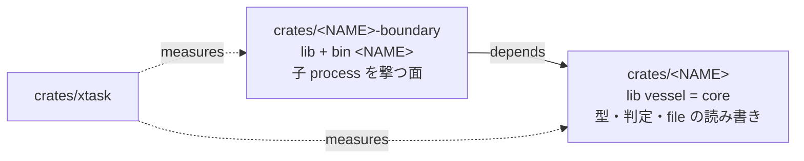

# 設計: core の境界 — core-lines は本体だけを数え、子 process を撃つ I/O 面は境界 crate へ分ける（binary は 1 つ）

- 要件: [FR47](../../design-intent/spec/srs.html#FR47) 契約表 / [FR48](../../design-intent/spec/srs.html#FR48) 受付の余地 / [NFR2](../../design-intent/spec/srs.html#NFR2) 大きさの上限
- 憲法: [C4](../../design-intent/spec/constitution.html#c4) core の大きさは CI の deny gate・上限の変更は A2 / [C13.2](../../design-intent/spec/constitution.html#c13) 境界 crate / [C2.2](../../design-intent/spec/constitution.html#c2) crate 名は NAME から導く / [C11](../../design-intent/spec/constitution.html#c11) lint / [C12.3](../../design-intent/spec/constitution.html#c12) 歯の比 / [A2](../../design-intent/spec/constitution.html#a2) 閾の変更は user 裁定 / [N4](../../design-intent/spec/constitution.html#n4) C4 の上限を超える変更は拒む
- 決定: [ADR-0033](../../design-intent/decisions/ADR-0033-core-lines-count-source-only-and-io-lives-in-a-boundary-crate.html)（core-lines の母集団と境界 crate・user 裁定 2026-09-15）/ [ADR-0001](../../design-intent/decisions/README.html)（単一 binary・不変）/ [ADR-0009](../../design-intent/decisions/README.html)（Rust で閉じる）
- 台帳: `s2-07l.198`（本設計の契約群の親）・出所の実測 = `s2-07l.303` run 2 / run 3（受付の core の余地で 2 度断られた 2026-09-15）
- 土台: [rules-manifest.md](./rules-manifest.md) §4（R-C4 行と行の数え方）/ [contract-source.md](./contract-source.md) §3（受付の余地）/ [pipeline.md](./pipeline.md) §5.3（純移動の機械証明）

やさしく言うと: 器の本体（core）の行数が上限の 9 割に来て、大きめの契約が受付で止まるようになった。上限は上げず、(1) 数え方から「test の行」を外し（test は別の上限が縛っている）、(2) 外の process を起こす部分だけを別の箱（境界 crate）に移して、本体を「判定と型」に絞る。実行 file は 1 つのまま。

## 1. 何を解くか（実測 2026-09-15・main 17943e7）

| 事実 | 値 |
|---|---|
| core-lines（R-C4-1 の測定値 / 上限） | 36,142 / 40,000（90.3%） |
| うち in-file の歯（`#[cfg(test)]` 区間） | 8,591 行（24%） |
| 子 process を撃つ file（`Command::new` の在る `.rs`） | 14 file / 9,888 行（file 全体・撃つ関数だけならその一部） |
| 受付が size M の契約に許す core の `.rs` 本数（300 行 × N ≤ 余地 3,858） | 12 本 |

- 受付（[contract-source.md](./contract-source.md) §3）は core の余地に「write-set の core の `.rs` 本数 × size」を当てる。余地が細るほど大きい契約が受付で止まり、契約を割る手作業が planner に戻る（`s2-07l.303` は 3 度目で通った）。
- 歯は R-C4-3（歯 / src の比）でも数えている＝R-C4-1 と二重計上（`check_sizes.rs` は `split_test_src` を持つが core-lines がそれを使っていない）。
- 上限 R-C4-1 を上げる案は採らない（憲法の順位: 成長の抑止が 2 位・上げても同じ問題を先送りする）。

## 2. core-lines の母集団 = src の本体（user 裁定 2026-09-15・A2）

- `measure_core_lines` は各 file の `split_test_src(width)` の **src 側だけ**を合計する（in-file の歯を外す）。上限 40,000 と行の数え方（幅の正規化・R-C4.line-width）は不変。
- 歯の量は従来どおり R-C4-3 が縛る（in-file の歯は今も test 側に数えている＝母集団の移動ではなく二重計上の解消）。
- 受付の余地（contract-source.md §3）は同じ式を core 側から呼ぶので自動で追随する（式は 2 か所・fixture で突合する歯が守る）。
- **core-spawn の検出線**（§5 の表の 2 行目・§6 (1) の便＝行 a が同じ便で足す）: measure `measure_core_spawn` を `measure_core_lines` の直後に宣言順で足す。母集団 = `core_dir/src` の `.rs` で `Command::new` を含む行、fact 行は `core-spawn=<n>/<files>`（件数 / file 数）、ok は**常に true**（数だけ出す検出線・値を持たない・deny へ倒すのは最後の移動の便＝§5 の bullet）。check の measure の列と check_tests の `SUMMARY_PIN` に core-lines の直後で載せる。
- 効果（実測）: 36,142 → 27,551（68.9%）。余地 3,858 → 12,449。
- 裁定 id = `user 2026-09-15T09:5xZ`（逐語は `s2-07l.198` notes・AskUserQuestion 問 1「in-file の歯を core-lines から外す (Recommended)」）。manifest の R-C4-1 行は値を変えないので行は不変（C5 の対象外）。数え方の文は [rules-manifest.md](./rules-manifest.md) §4 に 1 行足す。

## 3. crate の構成（user 裁定 2026-09-15・A2・ADR-0033）

- **core** = `crates/<NAME>`（lib `vessel`・現行）。型・閉じた enum・判定の純関数・state dir と repo の file の読み書き・event log。**`std::process::Command` を持たない**（xtask check の measure `core-spawn=0/N`・deny・§5）。
- **境界 crate** = `crates/<NAME>-boundary`（新規・名は NAME 定数から導く・C2.2）。子 process を起こす面 = tmux（`seat` の注入・立て直し）/ git（land・flip-check の base・vessel update）/ claude（headless の runner・lens・席の起動行）/ curl（fleet usage）/ cargo（vessel update・gate の verify 行）/ systemd（tick の unit）/ `sh -c`（gate の verify 行の実行）。**binary `<NAME>` は境界 crate が持つ**（`[[bin]] name = "<NAME>"`・`main.rs` を移す）。ADR-0001 の単一 binary は不変（crate は 2 つ・実行 file は 1 つ）。
- 依存は一方向: 境界 → core。core は境界を知らない（core の判定関数は「撃った結果」を値で受ける＝いまの `Outcome` / `Step` / `Measured` の形をそのまま使う）。
- **xtask の Layout**: `core_dir` = `crates/<NAME>`（NAME を持つ `name.rs` の在る member）・`boundary_dir` = `crates/<NAME>-boundary`（在れば）。R-C4-1 は `core_dir/src` だけ・R-C4-2（file-lines）と R-C4.line-width は全 member の `src`（現行どおり）・R-C4-3 は core + 境界の合計。**歯の置き場**: binary を引く歯（`tests/e2e/` の全体と snapshots・`CARGO_BIN_EXE_<NAME>` は同じ package の bin にしか渡らない＝実測 2026-09-15・8 file）は bin と一緒に境界 crate の `tests/` へ純移動する。in-file の歯（`#[cfg(test)]`）は module と一緒に動く。以後の契約の verify 行は e2e の歯を `-p <NAME>-boundary`・in-file の歯を `-p <NAME>` で名指す。
- **境界 crate の上限**（抜け穴の fence）: rules 行 `R-C4-5`（kind `BoundaryLines`・`ValueShape::Int`・deny）。core の外へ押し出して逃げる形（core を減らすために境界へ判定を持ち込む）を塞ぐ。行を足すのは段 3 (i)（値 = 移した直後の実測 × 1.2 を切り上げ・同じ裁定 id で manifest と憲法 §3 の cell に書く・C10）。段 2 の純移動は機械証明（`MoveSummary`）で判定を境界へ持ち込めないので、行の無い期間に抜け穴は無い。裁定 id = `user 2026-09-15T09:5xZ`（問 2「境界 crate へ分ける (Recommended)」）。
- 憲法 §3 の rules 表（constitution の閾値セル）は manifest の写し＝R-C4-5 を足す周は生成区間を再生成する（xtask の drift 歯）。C4 の条文は「core size / module size / test-to-source ratio / function granularity」の 4 つを名指す＝境界 crate の上限は C4 の「module size」の系ではなく新しい bound なので、**ADR-0033 が C4 の適用を記録し、条文は変えない**（N4 に当たらない: 条文の改訂でも C4 の bound の超過でもない）。

## 4. 境界の判定（何を境界 crate へ移すか・閉じた規則）

移す = **`std::process::Command` を構築する関数と、その引数を組み立てるためだけの関数**。判定（rc や出力を読んで typed な値へ倒す関数）は core に残す。

| core（残す） | 境界 crate（移す） |
|---|---|
| `Outcome` / `Step` / `Fired` / `Measured` / `Verdict` / `Refuse` の型と判定順（`decide` 等） | `run_line_captured`（`sh -c` の実行）/ `confine` の `systemd-run` の起動 / `admission` の probe |
| `derive_launch` / `with_model` / `fill_launch`（起動行の純関数） | tmux の `send-keys` / `list-panes` / `new-window` / `display-message` |
| `select` / `choose_or_wait` / `until` | `fleet::usage` の curl 起動・`headless::build` が組んだ `Command` の spawn |
| flip-check の判定（xtask・対象外） | land の `git`（archive / worktree / push）・`vessel update` の git と cargo |
| `Marker` / `rebrief` の DATA の組み立て | rebrief が撃つ `bd --readonly` / `git rev-parse` の子 process |

- 規則は 1 つ: **core に `Command::new` が 0**（xtask check の measure・§5）。「どの関数が I/O か」の判断を散文で持たない（C1.2 / N2）＝lint で決まる。
- 境界 crate の関数は「引数 → 子 process の起動 → 生の結果（rc / stdout / stderr の bytes）」だけを返し、解釈しない（解釈は core の純関数）。これも lint で守る: 境界 crate から core の判定関数を呼ぶのは可、core から境界を呼ぶのは依存の向きで不可（Cargo が拒む）。
- 例外なし。`env!` / `std::fs` / `std::net` は core に残る（C2.2 の env は元々読まない・fs は state dir と repo の読み書きで core の責務・net は無い）。

## 5. xtask check の measure（構造で止める）

| measure | 母集団 | 判定 |
|---|---|---|
| `core-lines` | `core_dir/src` の src 側（§2） | ≤ R-C4-1（deny・既存） |
| `core-spawn` | `core_dir/src` の `.rs` で `Command::new` を含む行 | 0 / N（deny・新規・値は持たない＝0 固定・`env-reads` と同型） |
| `boundary-lines` | `boundary_dir/src` の src 側 | ≤ R-C4-5（deny・新規・R-C4-5 が無い周は measure を出さない） |
| `file-lines` / `line-width` / `test-src-ratio` | 全 member の `src`（現行） | 不変 |

- `core-spawn` は §6 (1) の便で足し、移動が終わるまでは **検出線**（数だけ出す・`R-C12-1` と同型の enabled=false）として記録し、最後の移動の便で deny へ倒す（同じ裁定 id・C12.4 の型を借りるが rules 行は持たない＝0 固定の shape 検査）。
- 歯: `check_sizes.rs` の in-file の歯（fixture の `#[cfg(test)]` 区間が core-lines に入らない / boundary の上限を超える fixture / core に `Command::new` の在る fixture が名指される）。

## 6. 契約の列（段の中は並列・全部 `s2-07l.198` の子）

| 段 | 契約 | size | 依存 | write-set の芯 |
|---|---|---|---|---|
| 1 | (a) core-lines の母集団を src 側に（§2）+ `core-spawn` の検出線 | S | ADR-0033 | `xtask/check_sizes.rs` / `rules-manifest.md` の 1 行は planner |
| 1 | (b) workspace に `crates/<NAME>-boundary` を足す（lib + `main.rs` の移動 + `[[bin]]`）+ `crates/<NAME>/tests/` の純移動（binary を引く e2e の歯と snapshots・§3）+ Layout の `boundary_dir` | M（純移動） | ADR-0033・A3 = 非該当（依存 OSS を足さない）・走行中の便が全部 Landed した後（verify 行の `-p` を壊さない） | `Cargo.toml` / `crates/<NAME>-boundary/Cargo.toml` / `crates/<NAME>/Cargo.toml` / `xtask/workspace.rs` / `tests/` の移動 |
| 2 | (c)〜(h) 純移動 6 便（module ごと: `pipe/confine+admission` / `pipe/land+follow+stop+mod` / `seat/cycle+mod+rebrief` / `fleet/usage+cli` / `headless` / `hook/vessel+account`） | S〜M（各 ≤ 5 file） | (b) | 移す関数の file と境界 crate の新 module・呼び手の `use` |
| 3 | (i) `core-spawn` を deny に・`R-C4-5` 行を足す（値は実測で確定・憲法 §3 の cell も同じ周） | S | (c)〜(h) | `xtask/check_sizes.rs` / `rules/manifest.toml` / `rules/mod.rs` |

- 純移動の便は [pipeline.md](./pipeline.md) §5.3 の純移動の機械証明（`MoveSummary`）で lens に渡る。crate を跨ぐ移動は `use` の path が必ず変わる＝残差分に `use` を許す既存の規則の内側。
- 各便の size は「1 file あたりの増分の見積」で、移す側は縮む面（`-` 接頭辞・余地を求めない）、受ける側は新規 file（余地 = 全量）。
- 検証の形（base で RED）: (a) `core_lines_exclude_in_file_tests` / (b) `layout_finds_the_boundary_crate`（xtask）+ 境界 crate の e2e が bin を引ける（既存の e2e の歯が移動先で緑）/ (c)〜(h) 移動ごとに「core の `Command::new` の件数が N → N-k」を pin する歯（§5 の検出線の値・母集団つき）/ (i) `core_spawn_is_denied_when_nonzero`。

## 7. 却下案（設計固有）

- **R-C4-1 を上げる（44,000 等）**: 成長の抑止に反し、同じ受付の断りを数か月先送りするだけ。A2 の grill で「上げない」を推奨し裁定された。
- **pure な判定を新 crate `<NAME>-core` へ出す（I/O を残す）**: 移動量が 27k 行で純移動の証明が長引く。I/O を出す方が 3〜5k 行で済み、`Command::new` 0 の lint で境界が機械的に決まる。
- **crate を分けず module の分割と削減だけ**: 数百行しか減らず 90% は続く。上限に近い状態で受付が契約を割らせる運用が残る。
- **境界 crate に上限を置かない**: core から境界へ判定を押し出して core-lines を下げる抜け穴が開く（AI は抜け穴を突く・user 指摘 2026-09-14）。

## 8. 後続

- 契約表の行（contract-source.md §3 の Derived 形）は本 doc の §6 を出所に planner が起票する（`touches` / `surfaces` で write-set を導出）。
- v3 の材料（`s2-07l.42`）: 境界 crate の関数の形（引数 → 生の結果）は folio2 と共有できる「器の I/O 面」の芽。

<!-- contracts:begin -->
schema = 1

[[contract]]
id = "a"
title = "core-lines の母集団を src の本体に（in-file の歯を外す）+ core-spawn の検出線 — 受付の core の余地も同じ式に"
req = ["NFR3"]
section = "2"
write-set = ["crates/xtask/src/check_sizes.rs", "crates/xtask/src/check.rs", "crates/xtask/src/check_tests.rs", "crates/scribe2/src/pipe/closure.rs", "crates/scribe2/src/pipe/declaration/write_set.rs", "crates/scribe2/src/pipe/declaration.rs", "crates/scribe2/src/pipe/cli/intake.rs", "crates/scribe2/tests/e2e/pipe/intake.rs", "docs/design/rules-manifest.md"]
verify = ["cargo nextest run -p xtask --no-tests=fail sizes_core_", "cargo nextest run -p scribe2 --no-tests=fail pipe_intake_core_headroom_"]
size = "S"
done = "core-lines が in-file の歯を除いた src 側の合計になり、core-spawn の検出線が fact 行に出て、受付の core の余地が同じ式で数えられる（両側の式の一致を同じ fixture の歯が守る）"

[[contract]]
id = "b"
title = "境界 crate の新設 — lib + bin（main.rs の移動）+ tests/ の純移動 + xtask Layout の boundary_dir + 契約表の行の path 置換"
req = ["NFR3"]
section = "3"
write-set = ["Cargo.toml", "Cargo.lock", "+crates/scribe2-boundary/Cargo.toml", "+crates/scribe2-boundary/src/lib.rs", "+crates/scribe2-boundary/src/main.rs", "+crates/scribe2-boundary/src/snapshots/scribe2_boundary__tests__doctor_external_form.snap", "-crates/scribe2/src/main.rs", "-crates/scribe2/src/snapshots/scribe2__tests__doctor_external_form.snap", "crates/scribe2/Cargo.toml", "crates/scribe2/tests/", "+crates/scribe2-boundary/tests/e2e/fleet.rs", "+crates/scribe2-boundary/tests/e2e/headless.rs", "+crates/scribe2-boundary/tests/e2e/hook.rs", "+crates/scribe2-boundary/tests/e2e/main.rs", "+crates/scribe2-boundary/tests/e2e/pipe.rs", "+crates/scribe2-boundary/tests/e2e/pipe/gate.rs", "+crates/scribe2-boundary/tests/e2e/pipe/intake.rs", "+crates/scribe2-boundary/tests/e2e/pipe/land.rs", "+crates/scribe2-boundary/tests/e2e/pipe/lifecycle.rs", "+crates/scribe2-boundary/tests/e2e/pipe/spawn.rs", "+crates/scribe2-boundary/tests/e2e/polarity.rs", "+crates/scribe2-boundary/tests/e2e/prop.rs", "+crates/scribe2-boundary/tests/e2e/rules.rs", "+crates/scribe2-boundary/tests/e2e/seat.rs", "+crates/scribe2-boundary/tests/e2e/seat/account.rs", "+crates/scribe2-boundary/tests/e2e/seat/cycle.rs", "+crates/scribe2-boundary/tests/e2e/seat/launch.rs", "+crates/scribe2-boundary/tests/e2e/seat/register.rs", "+crates/scribe2-boundary/tests/e2e/seat/rules.rs", "+crates/scribe2-boundary/tests/e2e/seat/tick.rs", "+crates/scribe2-boundary/tests/e2e/seat/wm.rs", "+crates/scribe2-boundary/tests/e2e/snapshots/e2e__fleet__fleet_external_form.snap", "+crates/scribe2-boundary/tests/e2e/snapshots/e2e__headless__headless_external_form.snap", "+crates/scribe2-boundary/tests/e2e/snapshots/e2e__headless__headless_runner_prompt_external_form.snap", "+crates/scribe2-boundary/tests/e2e/snapshots/e2e__headless__lens_contract_prompt_external_form.snap", "+crates/scribe2-boundary/tests/e2e/snapshots/e2e__headless__lens_prompt_external_form.snap", "+crates/scribe2-boundary/tests/e2e/snapshots/e2e__hook__hook_brief_admin.snap", "+crates/scribe2-boundary/tests/e2e/snapshots/e2e__hook__hook_brief_planner.snap", "+crates/scribe2-boundary/tests/e2e/snapshots/e2e__hook__vessel_external_form.snap", "+crates/scribe2-boundary/tests/e2e/snapshots/e2e__pipe__gate__pipe_gate_move_summary_external_form.snap", "+crates/scribe2-boundary/tests/e2e/snapshots/e2e__pipe__gate__pipe_record_show_external_form.snap", "+crates/scribe2-boundary/tests/e2e/snapshots/e2e__pipe__pipe_external_form.snap", "+crates/scribe2-boundary/tests/e2e/snapshots/e2e__polarity__polarity_external_form.snap", "+crates/scribe2-boundary/tests/e2e/snapshots/e2e__rules__rules_external_form.snap", "+crates/scribe2-boundary/tests/e2e/snapshots/e2e__seat__seat_doctor_external_form.snap", "+crates/scribe2-boundary/tests/e2e/snapshots/e2e__seat__seat_rebrief_external_form.snap", "+crates/scribe2-boundary/tests/e2e/snapshots/e2e__seat__seat_usage_external_form.snap", "crates/xtask/src/workspace.rs", "crates/xtask/src/mutantsdiff.rs", "crates/xtask/src/check_sizes.rs", "docs/design/contract-source.md", "docs/design/working-memory.md", "docs/design/dialogue-surface.md"]
verify = ["cargo nextest run -p xtask --no-tests=fail layout_finds_the_boundary_crate", "cargo nextest run -p scribe2-boundary --no-tests=fail e2e"]
size = "M"
done = "境界 crate が bin と e2e の歯を持ち、移動した歯が移動先で全部緑（本数は base と同じ・母集団は notes）、xtask の Layout が boundary_dir を返し、契約表の行の path 置換後に contracts check が findings 0・insta の unreferenced が 0"
<!-- contracts:end -->
